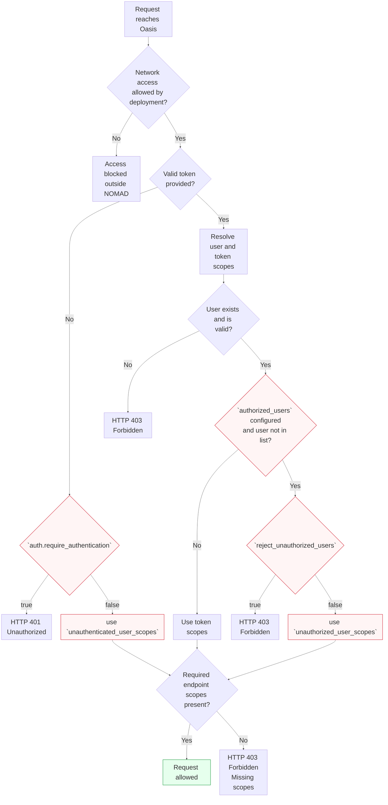

# Authentication and Authorization

Authentication determines **who is making the request**.
Authorization then determines **what that request is allowed to do**.

NOMAD supports multiple authentication mechanisms for API requests using [different types of tokens](#access-tokens).

<!--TODO: add link to auth "SECTION" in config page-->

The following diagram summarizes how access to an API endpoint is evaluated.
[Administrator-configurable settings](../reference/config.md) are highlighted in red.



## Access tokens

NOMAD supports several types of access tokens for authenticating and authorizing API requests:

- Keycloak access tokens – obtained through the login flow used by the web UI or API clients
- Personal Access Tokens (PATs) – long-lived tokens created by users for scripts and automation
- Upload tokens (*legacy, deprecated* — will be removed in a future release)
- Simple (app/signature) tokens (*legacy, deprecated* — will be removed in a future release)

### Keycloak access tokens

Keycloak access tokens authenticate a user through the NOMAD identity provider `keycloak`
using OpenID Connect (OIDC).

- Short-lived (currently 24 hours) and may require refreshing
- Primarily intended for interactive use (e.g. via the GUI)
- Grant the full set of user scopes (no scope restriction possible)

Due to these limitations, they are generally not suitable for long-running scripts or
automated workflows. Use **Personal Access Tokens (PATs)** instead.

### Personal Access Tokens (PATs)

Personal Access Tokens (PATs) are tokens created by users for programmatic access,
such as scripts, or automated workflows.

PATs can be issued with **explicit scopes**, allowing fine-grained control over
the operations a user or token is allowed to perform.

Unlike Keycloak access tokens, which typically have fixed and short lifetimes,
PATs can be created with a **customizable expiration time**, making them
well suited for long-running scripts or integrations where repeatedly acquiring
new tokens would be inconvenient.

PAT scopes must always be explicitly specified. Wildcard expressions such as
`*:read` are supported only in configuration and are **not allowed in tokens**.

For programmatic API usage, **Personal Access Tokens are generally the recommended
authentication method**.

!!! info "Deprecated tokens"

    ### Upload tokens

    Upload tokens are legacy tokens with a fixed scope set.
    They only grant upload-related permissions: `uploads:*`.

    ### Simple tokens

    Simple tokens are legacy tokens that grant a broad set of user permissions,
    effectively corresponding to full access except for token-management scopes.

    Both token types are deprecated and will be removed in a future release.
    They should not be used for new integrations. Use **Personal Access Tokens (PATs)** instead.

## Authorization via scopes

Authorization to use specific **API features** is scope-based.
After authentication, NOMAD determines the effective **scopes** that apply to the request.
Scopes define which API operations a user or token is allowed to perform.

A scope defines a permission in the format:

```text
<resource>:<action>
```

Examples:

```text
uploads:read
uploads:write
```

When an API endpoint is called, NOMAD checks whether the request has the scopes required by that endpoint.
If the required scopes are missing, the request is rejected.

For example, if an endpoint requires `uploads:write` and the token only has `uploads:read`,
the request will be rejected.

The following table lists all available authorization scopes.

In Python code, scopes are defined as enum members (e.g. `Scope.DATASETS_READ`),
whose value corresponds to the string representation used in tokens and configuration
(e.g. `datasets:read`).

{{ enum_table("nomad.auth.scopes.Scope") }}
