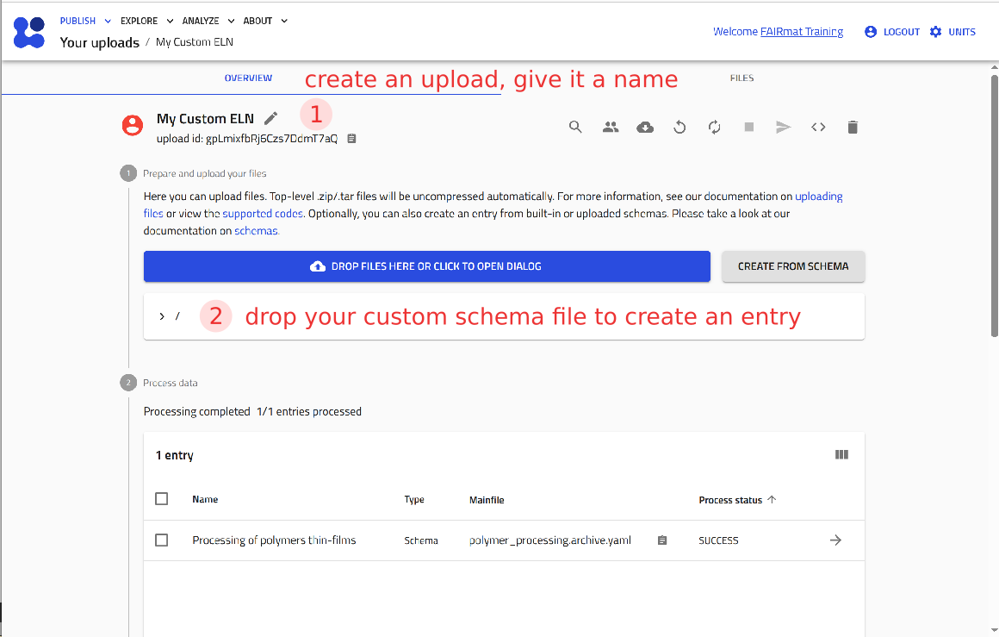
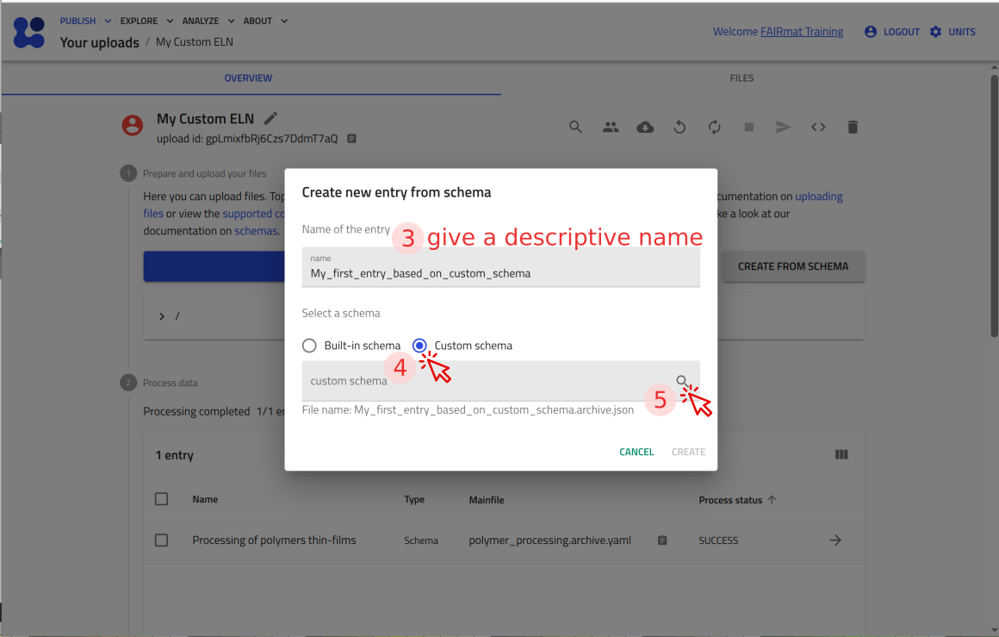
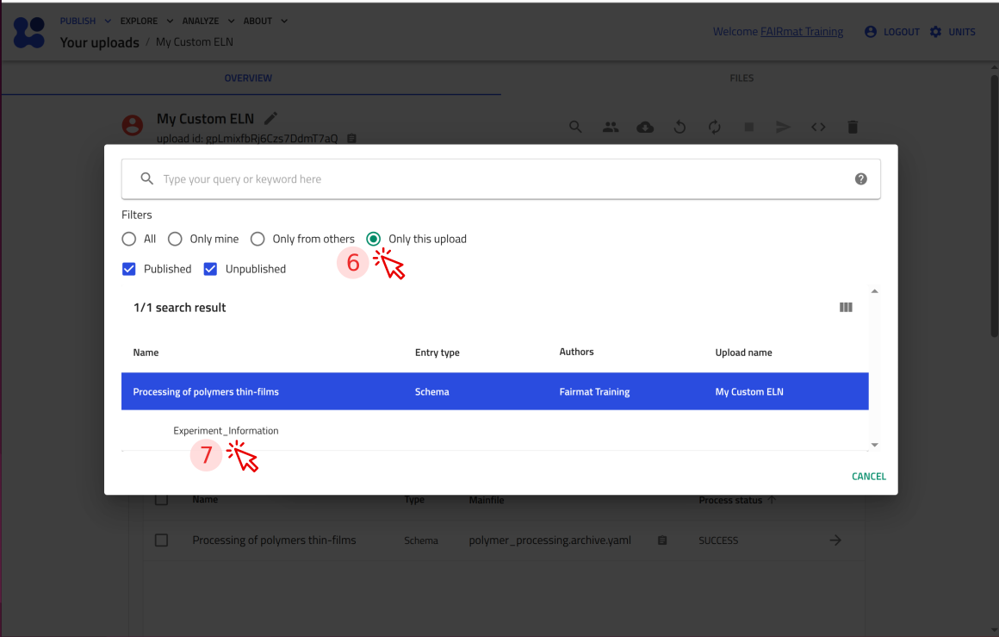
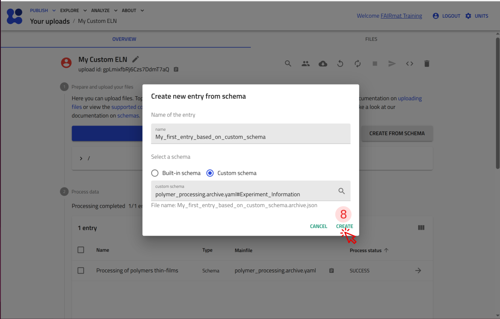
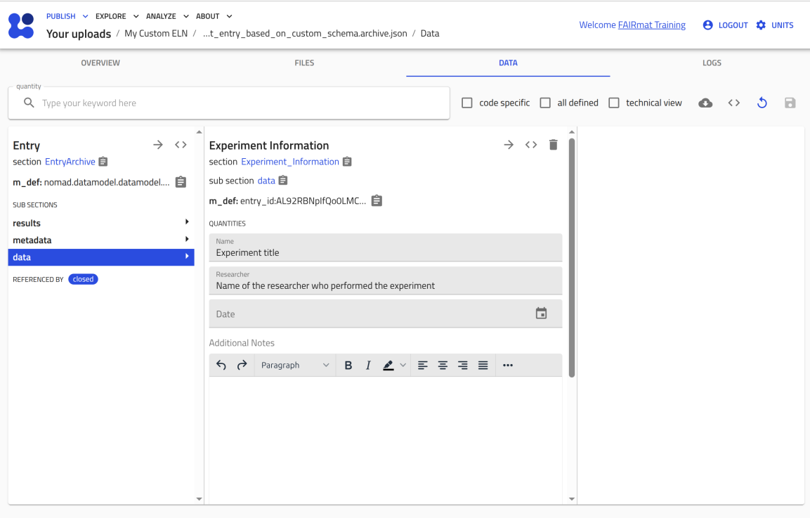
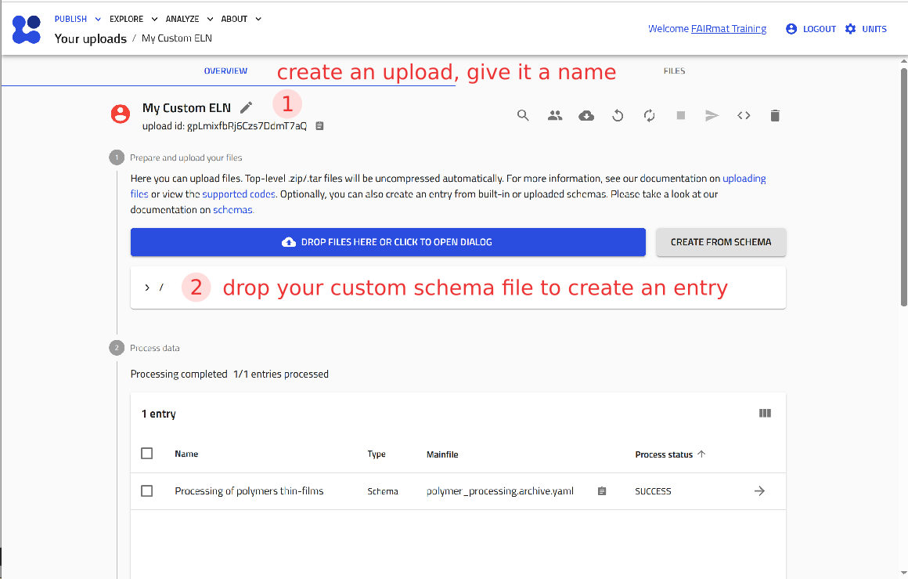
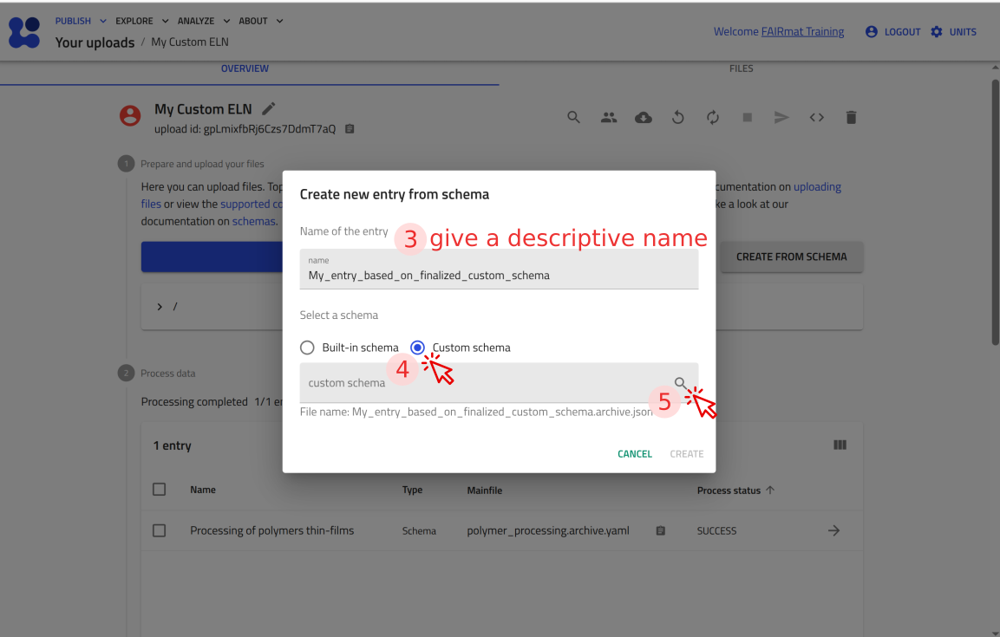
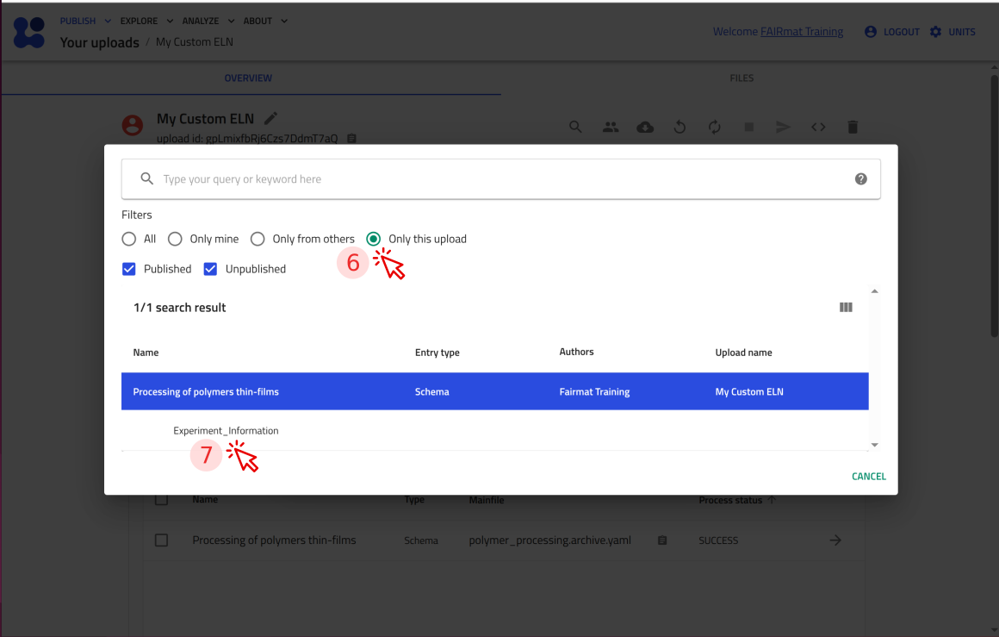
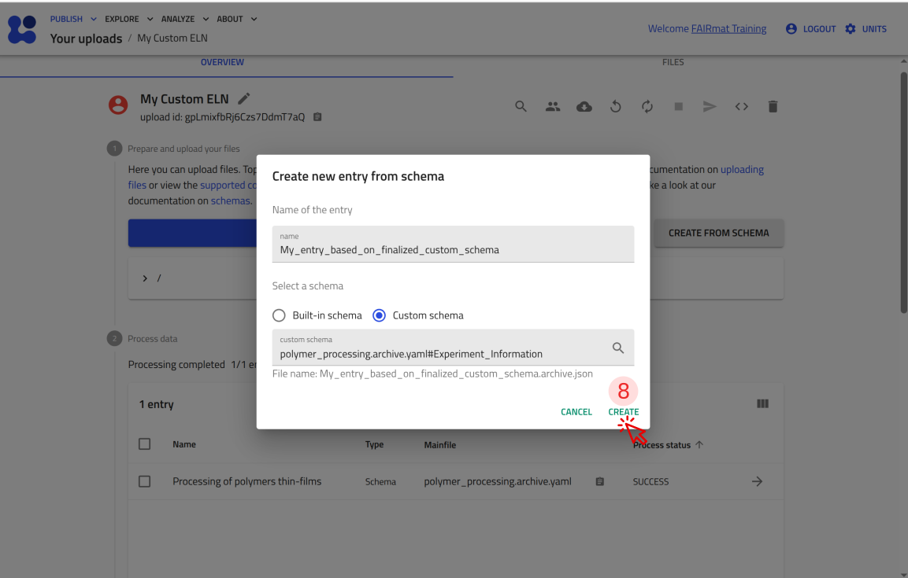
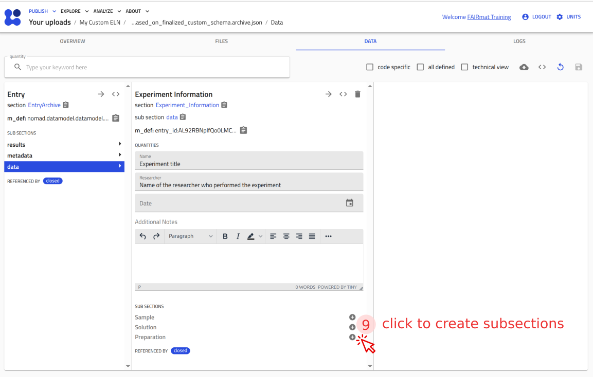

# Create a custom ELN schema in NOMAD using YAML

In this tutorial, we create a custom ELN using a YAML-based schema file to structure experimental data in NOMAD. We follow a step-by-step workflow to define sections, quantities, and annotations that shape how the experiment is represented in the GUI. By the end of the tutorial, we will have a functional custom ELN schema that can be uploaded and tested in NOMAD.

---

## What you will learn

In this tutorial, you will learn how to:

1. Create a custom ELN schema package using a `.archive.yaml` file
2. Define sections and quantities in a NOMAD schema
3. Reuse existing data models by inheriting from NOMAD base sections
4. Configure ELN input fields using annotations
5. Structure an ELN template using nested subsections
6. Use a custom ELN schema package in NOMAD as a template to document experiments

---

## Before you begin

This tutorial does not require prior experience with creating custom schemas. However, familiarity with the [NOMAD ELN functionality](built_in_templates.md){:target="_blank" rel="noopener"} is helpful.

Before starting, make sure you have:

1. **NOMAD user account**  
   Creating and editing ELN entries requires a NOMAD user account.
   You can create an account by following the steps described in the
   [overview page](../overview.md#create-a-nomad-user-account){:target="_blank" rel="noopener"}.

2. **Basic understanding of uploads and entries**  
   Familiarity with uploads and entries, and with how they relate to each other can be helpful. These concepts are introduced in the section [key elements in NOMAD](../upload_publish.md#the-key-elements-in-nomad){:target="_blank" rel="noopener"}.

3. **Basic familiarity with YAML configuration files**  
   This tutorial uses YAML to define the structure of a custom ELN schema. Prior experience with YAML syntax and indentation is helpful, but deep knowledge of YAML is not required.

4. **A YAML-capable editor or IDE (e.g., VS Code)**  
    You will edit a YAML file during the tutorial. Using an editor or IDE with YAML support (for example, VS Code) is recommended.

5. **Optional: familiarity with key NOMAD schema concepts**  
   It may be helpful to review the following concepts:
    - [Schema package](../../reference/glossary.md#schema-package){:target="_blank" rel="noopener"}, [Schema](../../reference/glossary.md#schema){:target="_blank" rel="noopener"}
    - [Section and Subsection](../../reference/glossary.md#section-and-subsection){:target="_blank" rel="noopener"}, [Quantity](../../reference/glossary.md#quantity){:target="_blank" rel="noopener"}
    - [Annotation](../../reference/glossary.md#annotation){:target="_blank" rel="noopener"}

??? example "About the example experiment used in this tutorial"

    In this tutorial, we use an example experiment involving the solution processing of polymer thin films to illustrate how experimental metadata can be structured in a custom ELN schema.

    The experiment is represented by general contextual metadata, including its name, the responsible researcher, the date, and free-text notes.

    In addition, the schema captures:

    - Information about the **sample** involved in the experiment.
    - Details of the **polymer solution**, including its concentration and composition.
    - The **substances** used to prepare the solution, together with the corresponding mass and volume.
    - A high-level description of the **processing step**.

    These elements mirror the structure that you will implement in the YAML schema and demonstrate how experimental metadata, materials, and preparation steps can be organized in a structured and reusable way.

---

## Step 1: Create the schema file

Create a new file named `polymer_processing.archive.yaml` in a local working directory. This file will contain the custom ELN schema definitions for the example experiment in this tutorial.

??? info "The `.archive.yaml` extension is needed"
    NOMAD recognizes files with the `.archive.yaml` extension as archive files. In this tutorial, we use such a file to define a schema package.

---

## Step 2: Declare the schema package

Open `polymer_processing.archive.yaml` and add the following content:

```yaml
definitions:
  name: Processing of polymer thin-films
  sections:
```

- `definitions:` declares a schema package and contains the metadata of your schema such as its name and the sections it contains.

- `name:` provides a human-readable identifier for the package.

- `sections:` introduces a block where the sections of your ELN schema will be defined.

Note that `name:` and `sections:` must be indented one level (two spaces) with respect to `definitions:`.

!!! info "YAML indentation matters"
    YAML uses indentation to define hierarchical structure. Indent by **two spaces** for **each level**.

    If NOMAD reports a YAML error, check that keys at the same level align.

At this point, the file declares an empty schema package that can now be extended with section definitions.

---

## Step 3: Add a main experiment section

A schema must contain at least one section. Here, you will define a section called `Experiment_Information` that will represent the experiment entry and hold all related metadata.

To ensure that this section is treated as a valid entry that is compatible with NOMAD's data model, inherit from the base section `nomad.datamodel.data.EntryData`, using `base_sections:`.

Add the following content to the schema file:

```yaml
    Experiment_Information:
      base_sections:
        - nomad.datamodel.data.EntryData
```

**Where to paste:** under `sections:` and indented one level (two spaces) with respect to it.

Note that `base_sections:` must be indented one level (two spaces) with respect to `Experiment_Information:`, and will include an indented list for the base sections to inherit from.

??? success "Checkpoint 1"
    Your file so far (after step 3) should look like the following:
    ```yaml
    definitions:
      name: Processing of polymer thin-films
      sections:
        Experiment_Information:
          base_sections:
            - nomad.datamodel.data.EntryData
    ```

    **How to read it:** so far, this `.archive.yaml` file defines a NOMAD schema package which has a definition. The schema package's `definitions` tells, it has a `name` and defines `sections`. The section `Experiment_Information` inherits from NOMAD base sections (using the `base_sections:` key). The one here is `nomad.datamodel.data.EntryData`.

---

## Step 4: Add quantities to the main section

Quantities define the individual data fields that will be stored for each experiment entry. They are added using `quantities:`.

Define the quantities `Name`, `Researcher`, `Date`, and `Additional_Notes`, by adding the following content to the schema file:

```yaml
      quantities:
        Name:
          type: str
          default: Experiment title
        Researcher:
          type: str
          default: Name of the researcher who performed the experiment
        Date:
          type: Datetime
        Additional_Notes:
          type: str
```

**Where to paste:** under `Experiment_Information` and indented one level (two spaces) with respect to it, i.e., `quantities:` aligns with `base_sections:`.

- Each quantity is defined by a name (for example, `Name` or `Date`).

- `type:` specifies the data type.

- `default:` provides a placeholder value (optional).

- If a quantity represents a physical value, you can also add a `unit` key.

??? success "Checkpoint 2"
    Your file so far (after step 4) should look like the following:
    ```yaml
    definitions:
      name: Processing of polymer thin-films
      sections:
        Experiment_Information:
          base_sections:
            - nomad.datamodel.data.EntryData
          quantities:
            Name:
              type: str
              default: Experiment title
            Researcher:
              type: str
              default: Name of the researcher who performed the experiment
            Date:
              type: Datetime
            Additional_Notes:
              type: str
    ```

---

## Step 5: Turn quantities into ELN fields

So far, you have defined the data structure of your schema.
Next, you will configure how these quantities are displayed and edited in the NOMAD ELN interface.

To do this, add an `m_annotations:` block to each quantity.
Start by updating the `Name` quantity as follows:

```yaml
        Name:
          type: str
          default: Experiment title
          m_annotations:
            eln:
              component: StringEditQuantity

```

- `m_annotations:` adds additional behavior to a section or quantity.

- `eln:` declares that the quantity is editable in the ELN interface.

- `component: StringEditQuantity` defines that the input format for this quantity is a short text field.

Note that `m_annotations:` is used to configure the `Name` quantity, it is indented one level (two spaces) with respect to `Name:`, i.e., it aligns with `type:` and `default:` in the `Name` block.

??? info "NOMAD's editable ELN components"
    For a list of editable components in NOMAD, see [editable quantities](https://nomad-lab.eu/prod/v1/gui/dev/editquantity){:target="_blank" rel="noopener"}.

Now update the remaining quantities:

- Use `StringEditQuantity` for `Researcher`.

- Use `DateTimeEditQuantity` for `Date`.

- Use `RichTextEditQuantity` for `Additional_Notes`.

After completing this step, your schema defines both structure and GUI behavior for the main experiment fields.

??? success "Checkpoint 3 - Test your schema in NOMAD"
    This is the complete `polymer_processing.archive.yaml` file up to this point. Use it as a checkpoint to compare against your file.

    ```yaml
    definitions:
      name: Processing of polymer thin-films
      sections:
        Experiment_Information:
          base_sections:
            - nomad.datamodel.data.EntryData
          quantities:
            Name:
              type: str
              default: Experiment title
              m_annotations:
                eln:
                  component: StringEditQuantity
            Researcher:
              type: str
              default: Name of the researcher who performed the experiment
              m_annotations:
                eln:
                  component: StringEditQuantity
            Date:
              type: Datetime
              m_annotations:
                eln:
                  component: DateTimeEditQuantity
            Additional_Notes:
              type: str
              m_annotations:
                eln:
                  component: RichTextEditQuantity
    ```
    You have reached the milestone: your schema is now functional.

    You can now upload this file to NOMAD and verify that it creates an ELN entry with the fields you defined.

    <p><strong>Use the arrow buttons ⬅️➡️ below to follow the steps for uploading the schema and creating a test ELN entry.</strong></p>
    <div class="image-slider" id="slider_milestone_custom_yaml">
        <div class="nav-arrow left" id="prev_milestone_custom_yaml">←</div>
        
        
        
        
        
        <div class="nav-arrow right" id="next_milestone_custom_yaml">→</div>
    </div>

---

## Step 6: Add subsections for sample, solution, and processing

Subsections define nested sections within a section. They allow you to group related information, such as sample details, solution composition, and preparation steps, into separate blocks within the ELN template.

In this step, you will extend your ELN schema by adding subsections under `Experiment_Information:` using the `sub_sections:` key.

Declare the subsections `Sample`, `Solution`, and `Preparation`, by adding the following content to the schema file:

```yaml
      sub_sections:
        Sample:
          section:

        Solution:
          section:

        Preparation:
          section:

```

- `sub_sections:` introduces nested sections inside `Experiment_Information`.

- Each subsection is defined by a name (for example, `Sample` or `Solution`)

- `section:` indicates that a section definition follows.

**Where to paste:** under `Experiment_Information` and indented one level (two spaces) with respect to it, i.e., `sub_sections` aligns with `base_sections:` and `quantities:`.

??? success "Checkpoint 4"
    This is the complete `polymer_processing.archive.yaml` file up to this point. Use it as a checkpoint to compare against your file.

    ```yaml
    definitions:
      name: Processing of polymer thin-films
      sections:
        Experiment_Information:
          base_sections:
            - nomad.datamodel.data.EntryData
          quantities:
            Name:
              type: str
              default: Experiment title
              m_annotations:
                eln:
                  component: StringEditQuantity
            Researcher:
              type: str
              default: Name of the researcher who performed the experiment
              m_annotations:
                eln:
                  component: StringEditQuantity
            Date:
              type: Datetime
              m_annotations:
                eln:
                  component: DateTimeEditQuantity
            Additional_Notes:
              type: str
              m_annotations:
                eln:
                  component: RichTextEditQuantity
          sub_sections:
            Sample:
              section:
            Solution:
              section:
            Preparation:
              section:
    ```

Next, you will define each subsection (`Sample`, `Solution`, and `Preparation`) using the same building blocks introduced in steps 3 to 5, such as `base_sections:`, `quantities:`, and `m_annotations:`.

These elements go under `section:` and are indented one level (two spaces) with respect to it.

**The sample subsection**

NOMAD already provides a generic base section for samples, i.e. `nomad.datamodel.metainfo.eln.ELNSample`.
By inheriting from it, you reuse NOMAD’s built-in sample structure instead of defining all the quantities yourself.
You can then tailor what is shown in the ELN by annotating the subsection and hiding inherited fields you don’t need.

Add the following content to the schema file:

```yaml
            base_sections:
              - nomad.datamodel.metainfo.eln.ELNSample
            m_annotations:
              eln:
                overview: true
                hide: ['chemical_formula']
```

**Where to paste:** under the `Sample:` subsection and indented two levels (four spaces) with respect to it, i.e., one level with respect to the `section:` key.

- `overview: true` shows the subsection in the entry’s **OVERVIEW** tab in the GUI.

- `hide: ['chemical_formula']` hides the `chemical_formula` field (inherited from `nomad.datamodel.metainfo.eln.ELNSample`) from your custom ELN.

**The solution subsection:**

Define the `Solution` subsection by inheriting from the base section `nomad.datamodel.metainfo.eln.ELNSample`, hiding the inherited fields `chemical_formula` and `description`, and adding a new quantity `Concentration` to capture a numeric value with a unit.

To achieve this, add the following content to your schema file:

```yaml
            base_sections:
              - nomad.datamodel.metainfo.eln.ELNSample
            m_annotations:
              eln:
                overview: true
                hide: ['chemical_formula', 'description']
            quantities:
              Concentration:
                type: np.float64
                unit: mg/ml
                m_annotations:
                  eln:
                    component: NumberEditQuantity
```

**Where to paste:** under the `Solution:` subsection and indented two levels (four spaces) with respect to it, i.e., one level with respect to the `section:` key.

- `overview: true` shows the Solution subsection in the entry’s **OVERVIEW** tab in the GUI.

- `hide: ['chemical_formula', 'description']` hides inherited fields from ELNSample that are not needed in this template.

- The `Concentration` quantity adds a numeric field with the `unit` mg/ml, rendered in the GUI using `NumberEditQuantity`.

**The preparation subsection**

NOMAD already provides a generic base section for processes, i.e. `nomad.datamodel.metainfo.eln.Process`. By inheriting from it, you can document preparation steps using NOMAD’s built-in process structure instead of defining all the quantities yourself.

Add the following content to the schema file:

```yaml
            base_sections:
              - nomad.datamodel.metainfo.eln.Process
            m_annotations:
              eln:
                overview: true
```

**Where to paste:** under the `Preparation:` subsection and indented two levels (four spaces) with respect to it, i.e., one level with respect to the `section:` key.

??? success "Checkpoint 5"
    This is the complete `polymer_processing.archive.yaml` file up to this point. Use it as a checkpoint to compare against your file.

    ```yaml
    definitions:
      name: Processing of polymer thin-films
      sections:
        Experiment_Information:
          base_sections:
            - nomad.datamodel.data.EntryData
          quantities:
            Name:
              type: str
              default: Experiment title
              m_annotations:
                eln:
                  component: StringEditQuantity
            Researcher:
              type: str
              default: Name of the researcher who performed the experiment
              m_annotations:
                eln:
                  component: StringEditQuantity
            Date:
              type: Datetime
              m_annotations:
                eln:
                  component: DateTimeEditQuantity
            Additional_Notes:
              type: str
              m_annotations:
                eln:
                  component: RichTextEditQuantity
          sub_sections:
            Sample:
              section:
                base_sections:
                  - nomad.datamodel.metainfo.eln.ELNSample
                m_annotations:
                  eln:
                    overview: true
                    hide: ['chemical_formula']
            Solution:
              section:
                base_sections:
                  - nomad.datamodel.metainfo.eln.ELNSample
                m_annotations:
                  eln:
                    overview: true
                    hide: ['chemical_formula', 'description']
                quantities:
                  Concentration:
                    type: np.float64
                    unit: mg/ml
                    m_annotations:
                      eln:
                        component: NumberEditQuantity
            Preparation:
              section:
                base_sections:
                  - nomad.datamodel.metainfo.eln.Process
                m_annotations:
                  eln:
                    overview: true
    ```

---

**Nested subsections**

It is also possible to define subsections within other subsections. In this case, you will extend the `Solution` subsection by adding two nested subsections, `Solute` and `Solvent`.

These nested subsections allow you to record the solution composition by linking to existing substance entries and capturing the corresponding mass and volume.

Add the following `sub_sections:` block inside the `Solution` subsection:

```yaml
            sub_sections:
              Solute:
                section:
                  quantities:
                    Substance:
                      type: nomad.datamodel.metainfo.eln.ELNSubstance
                      m_annotations:
                        eln:
                          component: ReferenceEditQuantity
                    Mass:
                      type: np.float64
                      unit: kilogram
                      m_annotations:
                        eln:
                          component: NumberEditQuantity
                          defaultDisplayUnit: milligram
              Solvent:
                section:
                  quantities:
                    Substance:
                      type: nomad.datamodel.metainfo.eln.ELNSubstance
                      m_annotations:
                        eln:
                          component: ReferenceEditQuantity
                    Volume:
                      type: np.float64
                      unit: meter ** 3
                      m_annotations:
                        eln:
                          component: NumberEditQuantity
                          defaultDisplayUnit: milliliter
```

**Where to paste:** under the `Solution:` subsection and indented two levels (four spaces) with respect to it, i.e., one level with respect to the `section:` key and aligned with `base_sections:`, `m_annotations:`, and `quantities:` of that section.

- The `Substance` quantity uses `ReferenceEditQuantity` to link to an existing `ELNSubstance` entry.

- `Mass` and `Volume` are numeric quantities with physical units.

- `defaultDisplayUnit` controls which unit is shown by default in the GUI.

??? warning "Indentation check"
    Indentation matters in YAML because it defines the structure of your schema.

    - Keys at the same level should have the same indentation (for example, `Sample`, `Solution`, and `Preparation` under `sub_sections:`).
    - Keys that define a section (`base_sections`, `quantities`, `sub_sections`, `m_annotations`) must be indented one level (two spaces) deeper than the section name.
    - Keys that define a quantity (`type`, `unit`, `default`, `m_annotations`) must be indented one level (two spaces) deeper than the quantity name.

??? success "Checkpoint 6 (final file)"
    This is the complete `polymer_processing.archive.yaml` file up to this point. Use it as a checkpoint to compare against your file.

    ```yaml
    definitions:
      name: Processing of polymer thin-films
      sections:
        Experiment_Information:
          base_sections:
            - nomad.datamodel.data.EntryData
          quantities:
            Name:
              type: str
              default: Experiment title
              m_annotations:
                eln:
                  component: StringEditQuantity
            Researcher:
              type: str
              default: Name of the researcher who performed the experiment
              m_annotations:
                eln:
                  component: StringEditQuantity
            Date:
              type: Datetime
              m_annotations:
                eln:
                  component: DateTimeEditQuantity
            Additional_Notes:
              type: str
              m_annotations:
                eln:
                  component: RichTextEditQuantity
          sub_sections:
            Sample:
              section:
                base_sections:
                  - nomad.datamodel.metainfo.eln.ELNSample
                m_annotations:
                  eln:
                    overview: true
                    hide: ['chemical_formula']
            Solution:
              section:
                base_sections:
                  - nomad.datamodel.metainfo.eln.ELNSample
                m_annotations:
                  eln:
                    overview: true
                    hide: ['chemical_formula', 'description']
                quantities:
                  Concentration:
                    type: np.float64
                    unit: mg/ml
                    m_annotations:
                      eln:
                        component: NumberEditQuantity
                sub_sections:
                  Solute:
                    section:
                      quantities:
                        Substance:
                          type: nomad.datamodel.metainfo.eln.ELNSubstance
                          m_annotations:
                            eln:
                              component: ReferenceEditQuantity
                        Mass:
                          type: np.float64
                          unit: kilogram
                          m_annotations:
                            eln:
                              component: NumberEditQuantity
                              defaultDisplayUnit: milligram
                  Solvent:
                    section:
                      quantities:
                        Substance:
                          type: nomad.datamodel.metainfo.eln.ELNSubstance
                          m_annotations:
                            eln:
                              component: ReferenceEditQuantity
                        Volume:
                          type: np.float64
                          unit: meter ** 3
                          m_annotations:
                            eln:
                              component: NumberEditQuantity
                              defaultDisplayUnit: milliliter
            Preparation:
              section:
                base_sections:
                  - nomad.datamodel.metainfo.eln.Process
                m_annotations:
                  eln:
                    overview: true
    ```

    **How to read it:** This `.archive.yaml` file defines a schema package under `definitions`. The package has a `name` and defines one main section, `Experiment_Information`, under `sections:` keyword. The main section `Experiment_Information` inherits from some base sections using `base_sections:`keyword (here `nomad.datamodel.data.EntryData`), defines some quantities under `quantities:` keyword, and groups additional information by introducing three subsections `Sample`, `Solution`, `Preparation`, using `sub_sections:` keyword. Each of these three subsections has its own section definition (with keys like `base_sections:`, `quantities:`, `sub_sections:`, and `m_annotations:` like before). The `Solution` subsection itself also contains two nested subsections, `Solute` and `Solvent`, each with its own definition.

---

## Step 7: Test your custom schema in NOMAD

You can now upload this file to NOMAD and verify that it creates an ELN entry with the fields you defined.

<p><strong>Use the arrow buttons ⬅️➡️ below to follow the steps for uploading the schema and creating a test ELN entry.</strong></p>
<div class="image-slider" id="slider_final_custom_yaml">
    <div class="nav-arrow left" id="prev_final_custom_yaml">←</div>
    
    
    
    
    
    <div class="nav-arrow right" id="next_final_custom_yaml">→</div>
</div>
