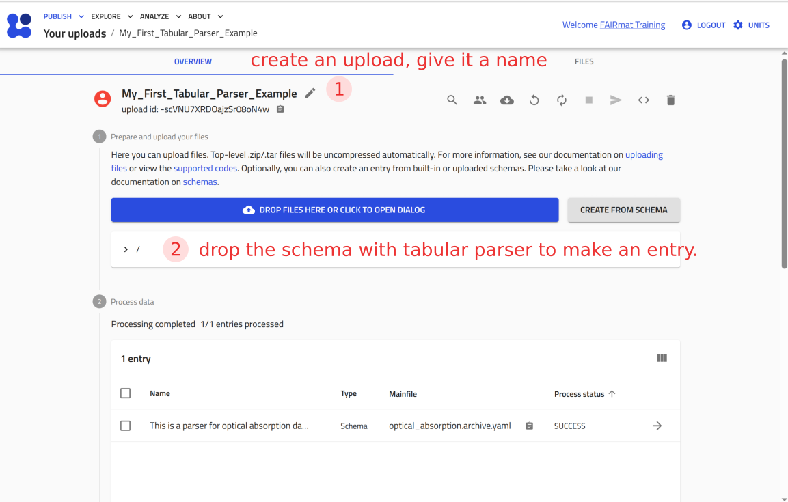
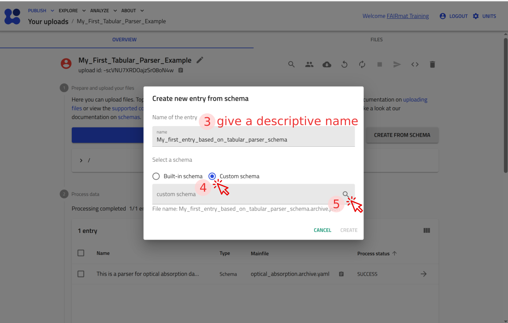
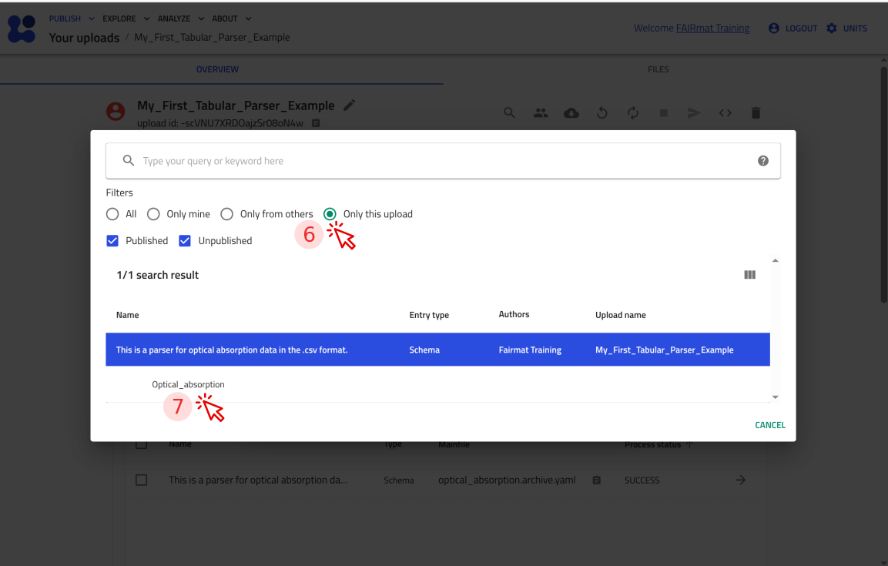
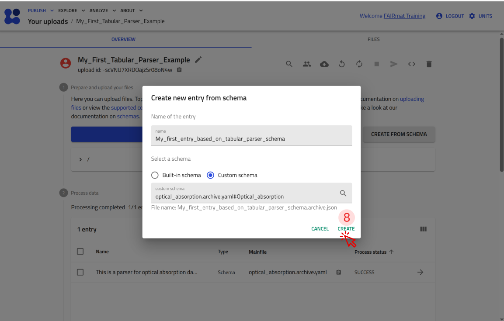
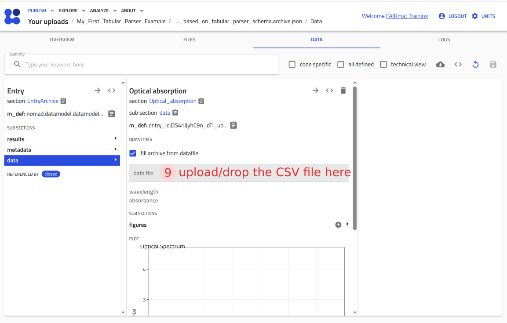
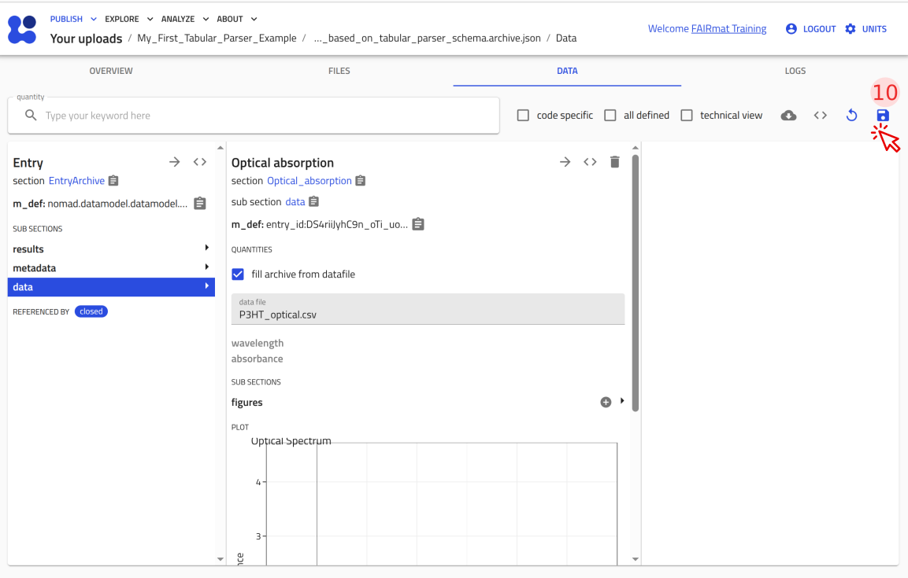
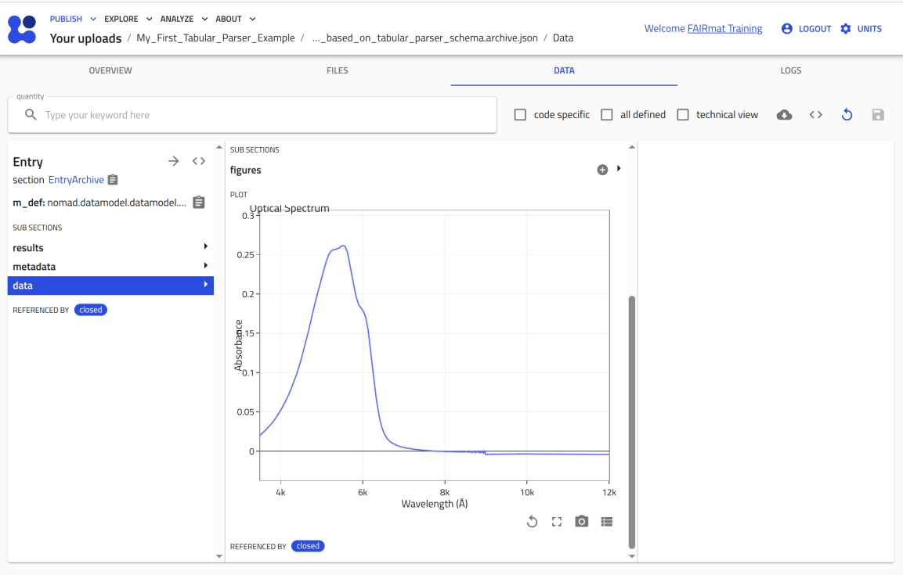

# Parse tabular measurement data with the tabular parser

In this tutorial, we transform a tabular measurement file into a structured NOMAD entry using NOMAD's tabular parser. We build and configure a YAML-based parser that extracts data from tabular files such as `.csv` or `.xlsx`, stores them as an entry, and enables visualization in NOMAD. By the end of the tutorial, we will have created a reusable parser for tabular data that can be integrated into a custom ELN schema.

---

## What you will learn

In this tutorial, you will learn how to:

1. Create a tabular parser section in a `.archive.yaml` schema file to parse a `.csv` file.
2. Configure the tabular parser to map data from a `.csv` file to schema quantities.
3. Create plots of the parsed data directly in NOMAD.
4. Integrate the tabular parser into a custom NOMAD ELN schema to attach measurement data to an ELN entry.

---

## Before you begin

This tutorial builds on the previous tutorial [create a custom ELN schema in NOMAD using YAML](custom_eln_yaml.md){:target="_blank" rel="noopener"}. Basic familiarity with defining sections and quantities in a `.archive.yaml` file is assumed.

Before starting, make sure you have:

1. **NOMAD user account**  
   Creating and editing ELN entries requires a NOMAD user account.
   You can create an account by following the steps described in the
   [overview page](../overview.md#create-a-nomad-user-account){:target="_blank" rel="noopener"}.

2. **Basic understanding of uploads and entries**  
   Familiarity with uploads and entries, and how they relate to each other can be helpful. These concepts are introduced in the section [key elements in NOMAD](../upload_publish.md#the-key-elements-in-nomad){:target="_blank" rel="noopener"}.

3. **Basic familiarity with YAML configuration files**  
   This tutorial uses YAML to define the tabular parser. Prior experience with YAML syntax and indentation is helpful, but deep knowledge of YAML is not required.

4. **A YAML-capable editor or IDE (e.g., VS Code)**  
    You will edit a YAML file during the tutorial. Using an editor or IDE with YAML support (for example, VS Code) is recommended.

??? example "About the measurement data used in this tutorial"

    In this tutorial, we use an example optical absorption spectrum of P3HT to demonstrate how tabular measurement data stored in a `.csv` file can be parsed, structured, and visualized in a custom NOMAD ELN schema.

    Download the example file [`P3HT_optical.csv`](data/P3HT_optical.csv){:download}

    The file contains two columns:

    - `Wavelength` (in nanometers)
    - `Absorbance`

    Each row represents one measurement point of the optical spectrum.

    You will configure the tabular parser to read these columns into array quantities (`wavelength` and `absorbance`) and visualize the spectrum directly in the ELN.

    In the final optional step, you will integrate this optical absorption section into the polymer-processing ELN schema created in the previous tutorial.

    Download the custom polymer-processing schema file [`polymer_processing.archive.yaml`](data/polymer_processing.archive.yaml){:download}.

---

## Step 1: Declare the schema package and add a parser section

Create a new file named `optical_absorption.archive.yaml` in a local working directory, then add the following content:

```yaml
definitions:
  name: This is a parser for optical absorption data in the .csv format.
  sections:
    Optical_absorption:
```

- `definitions:` declares a schema package and contains the metadata of your schema such as its name and the sections it contains.

- `name:` provides a human-readable identifier for the package.

- `sections:` introduces a block where individual sections are defined. Here, you define a section named `Optical_absorption`, which will configure how the tabular data file is parsed and visualized.

Note that `name:` and `sections:` must be indented one level (two spaces) with respect to `definitions:`.

## Step 2: Inherit the base sections for parsing and plotting

To ensure that the `Optical_absorption` section is treated as a valid NOMAD entry and supports tabular file parsing and visualization, inherit from the appropriate base sections using `base_sections:`.

Add the following content to the schema file:

```yaml
      base_sections:
        - nomad.datamodel.data.EntryData
        - nomad.parsing.tabular.TableData
        - nomad.datamodel.metainfo.plot.PlotSection
```

**Where to paste:** under `Optical_absorption:` and indented one level (two spaces) with respect to it.

??? success "Checkpoint 1"
    Your file so far (after step 2) should look like the following:
    ```yaml
    definitions:
      name: This is a parser for optical absorption data in the .csv format.
      sections:
        Optical_absorption:
          base_sections:
            - nomad.datamodel.data.EntryData
            - nomad.parsing.tabular.TableData
            - nomad.datamodel.metainfo.plot.PlotSection
    ```

## Step 3: Add the quantities to the parser section

Now define the quantities required for the tabular parser section:

You will define:

- `data_file` to store the uploaded `.csv` file.
- `wavelength` to store x-axis values extracted from the file.
- `absorbance` to store y-axis values extracted from the file.

Add the following content to the schema file:

```yaml
      quantities:
        data_file:
          type: str
        wavelength:
          type: np.float64
          unit: nm
          shape: ['*']
        absorbance:
          type: np.float64
          shape: ['*']

```

**Where to paste:** under `Optical_absorption:` and indented one level (two spaces) with respect to it, i.e., `quantities` aligns with `base_sections:`.

- Since `wavelength` and `absorbance` contain multiple data points, define them as arrays using `shape: ['*']`.
- If a quantity represents a physical value, you can also provide a `unit` (here: `nm` for `wavelength`).

??? success "Checkpoint 2"
    Your file so far (after step 3) should look like the following:
    ```yaml
    definitions:
      name: This is a parser for optical absorption data in the .csv format.
      sections:
        Optical_absorption:
          base_sections:
            - nomad.datamodel.data.EntryData
            - nomad.parsing.tabular.TableData
            - nomad.datamodel.metainfo.plot.PlotSection
          quantities:
            data_file:
              type: str
            wavelength:
              type: np.float64
              unit: nm
              shape: ['*']
            absorbance:
              type: np.float64
              shape: ['*']
    ```

## Step 4: Configure how NOMAD handles the quantities

In Step 3, you defined the required quantities for the tabular parser. Now you add an `m_annotations:` block to each quantity, so that NOMAD knows how to handle it correctly in the GUI and during parsing.

**The `data_file` quantity**

Configure the `data_file` quantity using three annotations so that:

- It accepts files as input, either via drag-and-drop or the file selection browser via the `eln` annotation.
- It supports file actions in the GUI like previewing or downloading the raw file via the `browser` annotation.
- The tabular parser is automatically applied to extract data from the attached file via the `tabular_parser` annotation.

Add the following content to the schema file:

```yaml
          m_annotations:
            eln:
              component: FileEditQuantity
            browser:
              adaptor: RawFileAdaptor
            tabular_parser:
              parsing_options:
                comment: '#'
                skiprows: [1]
              mapping_options:
                - mapping_mode: column
                  file_mode: current_entry
                  sections:
                    - '#root'
```

**Where to paste:** under `data_file` and indented one level (two spaces) with respect to it, i.e., `m_annotations:` aligns with `type:`.

- `component: FileEditQuantity` under the `eln` annotation enables the file upload function in NOMAD.
- `adaptor: RawFileAdaptor` under the `browser` annotation enables file actions in the GUI, e.g., file preview and download.
- `parsing_options:` under the `tabular_parser` annotation defines how the raw file is read before its contents are mapped to schema quantities.
    - `comment: '#'` ignores commented lines in the file.
    - `skiprows: [1]` skips the second row (row index `1`), which contains the units, so the remaining rows can be parsed as numeric values.
- `mapping_options:` under the `tabular_parser` annotation defines how the parsed table data are written into your schema.
    - `mapping_mode: column` maps each column of the file to the corresponding schema quantities.
    - `file_mode: current_entry` processes the parsed data into the same NOMAD entry instead of creating a new one.
    - `sections: ['#root']` specifies that the mapped quantities are filled into the root section of the entry (here, the `Optical_absorption` section).

**The `wavelength` quantity**

This quantity will be filled with values extracted from the column whose header is `Wavelength`.

Add a `tabular` annotation under `wavelength` so NOMAD knows which column to map into this quantity:

```yaml
          m_annotations:
            tabular:
              name: Wavelength
```

**Where to paste:** inside your `wavelength:` quantity block, aligned with `type:`.

`name:` under the `tabular` annotation specifies the header of the column that should be mapped to this quantity.

**The `absorbance` quantity**

This quantity will be filled with values extracted from the column whose header is `Absorbance`.

Add a `tabular` annotation under `absorbance` quantity:

```yaml
          m_annotations:
            tabular:
              name: Absorbance
```

**Where to paste:** inside your `absorbance:` quantity block, aligned with `type:`.

!!! warning "Use the exact column header"
    The value of the `name:` key (under the `tabular:` annotation) must **exactly** match the column header in the `.csv` file, including spelling and capitalization.

    If the header does not match, the column will not be mapped to the quantity.

??? success "Checkpoint 3"
    Your file so far (after step 4) should look like the following:
    ```yaml
    definitions:
      name: This is a parser for optical absorption data in the .csv format.
      sections:
        Optical_absorption:
          base_sections:
            - nomad.datamodel.data.EntryData
            - nomad.parsing.tabular.TableData
            - nomad.datamodel.metainfo.plot.PlotSection
          quantities:
            data_file:
              type: str
              m_annotations:
                eln:
                  component: FileEditQuantity
                browser:
                  adaptor: RawFileAdaptor
                tabular_parser:
                  parsing_options:
                    comment: '#'
                    skiprows: [1]
                  mapping_options:
                    - mapping_mode: column
                      file_mode: current_entry
                      sections:
                        - '#root'
            wavelength:
              type: np.float64
              unit: nm
              shape: ['*']
              m_annotations:
                tabular:
                  name: Wavelength
            absorbance:
              type: np.float64
              shape: ['*']
              m_annotations:
                tabular:
                  name: Absorbance
    ```

## Step 5: Create a plot for the data

So far, you have defined how the tabular data are parsed and mapped to schema quantities.

In this step, you will configure how these quantities are visualized in the NOMAD ELN by adding a `plotly_graph_object` annotation to the `Optical_absorption` section.

Add the following content to the schema file:

```yaml
      m_annotations:
        plotly_graph_object:
          data:
            x: "#wavelength"
            y: "#absorbance"
          layout:
            title: Optical Spectrum
```

**Where to paste:** inside your `Optical_absorption:` section definition and indented one level (two spaces) with respect to it, i.e., `m_annotations:` aligns with `base_sections:` and `quantities:`.

- `plotly_graph_object:` annotation enables plotting for this section.
- `data:` defines the quantities used for the axes.
    - `x: "#wavelength"` sets the horizontal axis.
    - `y: "#absorbance"` sets the vertical axis.
    - Values prefixed with `#` reference quantities defined in this section.
- `layout:` defines the plot appearance.
    - `title:` sets the title which is displayed above the plot.

??? success "Checkpoint 4 (complete tabular parser)"
    This is the complete `optical_absorption.archive.yaml` file up to this point. Use it as a checkpoint to compare against your file.

    ```yaml
    definitions:
      name: This is a parser for optical absorption data in the .csv format.
      sections:
        Optical_absorption:
          base_sections:
            - nomad.datamodel.data.EntryData
            - nomad.parsing.tabular.TableData
            - nomad.datamodel.metainfo.plot.PlotSection
          quantities:
            data_file:
              type: str
              m_annotations:
                eln:
                  component: FileEditQuantity
                browser:
                  adaptor: RawFileAdaptor
                tabular_parser:
                  parsing_options:
                    comment: '#'
                    skiprows: [1]
                  mapping_options:
                    - mapping_mode: column
                      file_mode: current_entry
                      sections:
                        - '#root'
            wavelength:
              type: np.float64
              unit: nm
              shape: ['*']
              m_annotations:
                tabular:
                  name: Wavelength
            absorbance:
              type: np.float64
              shape: ['*']
              m_annotations:
                tabular:
                  name: Absorbance
          m_annotations:
            plotly_graph_object:
              data:
                x: "#wavelength"
                y: "#absorbance"
              layout:
                title: Optical Spectrum
    ```

    **How to read it:** This `.archive.yaml` file defines a schema package under `definitions`. The package has a `name` and defines one main section called `Optical_absorption` under `sections:` keyword. The `Optical_absorption` section uses `nomad.datamodel.data.EntryData` to make an entry, `nomad.parsing.tabular.TableData` to be able to read the tabular data files, and `nomad.datamodel.metainfo.plot.PlotSection` to prepare a plot. It defines three quantities `data_file`, `wavelength`, and `absorbance` with proper `shape` and `type`, and uses `m_annotations:` to configure file upload, parsing, and to plot `absorbance` versus `wavelength`.

## Step 6: Test your tabular parser in NOMAD

You can now upload this file to NOMAD and verify that it creates an entry where you can attach `P3HT_optical.csv` and see the plot.

  <p><strong>Use the arrow buttons ⬅️➡️ below to follow the steps for uploading the schema and creating a test entry.</strong></p>
  <div class="image-slider" id="slider_milestone_tabular_parser">
      <div class="nav-arrow left" id="prev_milestone_tabular_parser">←</div>
      
      
      
      
      
      
      
      <div class="nav-arrow right" id="next_milestone_tabular_parser">→</div>
  </div>

## Step 7: Integrate the tabular parser section into an ELN template

So far, you have created a standalone schema section for parsing and visualizing optical absorption data.

In this step, you will reuse this section inside the polymer-processing ELN schema created in the [previous tutorial](custom_eln_yaml.md){:target="_blank" rel="noopener"}.

This allows you to upload an optical absorption file and visualize the spectrum directly within the same ELN entry.

!!! task "Task"
     Add the `Optical_absorption` section as a subsection in the `polymer_processing.archive.yaml` custom ELN schema.
     Ensure that:

    - `Optical_absorption:` appears inside the `sub_sections:` block of `Experiment_Information`.
    - Its indentation level matches that of `Sample`, `Solution`, and `Preparation`.

??? success "Solution"
    In your `polymer_processing.archive.yaml`, add an `Optical_absorption` subsection under `Experiment_Information` and give it the same section definition you built in this tutorial (the one that includes `TableData` and `PlotSection`).

    The complete example below shows one possible result, where `Optical_absorption` is added at the same level as `Sample`, `Solution`, and `Preparation`.

    ```yaml
    definitions:
      name: Processing of polymer thin-films
      sections:
        Experiment_Information:
          base_sections:
            - nomad.datamodel.data.EntryData
          quantities:
            Name:
              type: str
              default: Experiment title
              m_annotations:
                eln:
                  component: StringEditQuantity
            Researcher:
              type: str
              default: Name of the researcher who performed the experiment
              m_annotations:
                eln:
                  component: StringEditQuantity
            Date:
              type: Datetime
              m_annotations:
                eln:
                  component: DateTimeEditQuantity
            Additional_Notes:
              type: str
              m_annotations:
                eln:
                  component: RichTextEditQuantity
          sub_sections:
            Sample:
              section:
                base_sections:
                  - nomad.datamodel.metainfo.eln.ELNSample
                m_annotations:
                  eln:
                    overview: true
                    hide: ['chemical_formula']
            Solution:
              section:
                base_sections:
                  - nomad.datamodel.metainfo.eln.ELNSample
                m_annotations:
                  eln:
                    overview: true
                    hide: ['chemical_formula', 'description']
                quantities:
                  Concentration:
                    type: np.float64
                    unit: mg/ml
                    m_annotations:
                      eln:
                        component: NumberEditQuantity
                sub_sections:
                  Solute:
                    section:
                      quantities:
                        Substance:
                          type: nomad.datamodel.metainfo.eln.ELNSubstance
                          m_annotations:
                            eln:
                              component: ReferenceEditQuantity
                        Mass:
                          type: np.float64
                          unit: kilogram
                          m_annotations:
                            eln:
                              component: NumberEditQuantity
                              defaultDisplayUnit: milligram
                  Solvent:
                    section:
                      quantities:
                        Substance:
                          type: nomad.datamodel.metainfo.eln.ELNSubstance
                          m_annotations:
                            eln:
                              component: ReferenceEditQuantity
                        Volume:
                          type: np.float64
                          unit: meter ** 3
                          m_annotations:
                            eln:
                              component: NumberEditQuantity
                              defaultDisplayUnit: milliliter
            Preparation:
              section:
                base_sections:
                  - nomad.datamodel.metainfo.eln.Process
                m_annotations:
                  eln:
                    overview: true
            Optical_absorption:
              section:
                base_sections:
                  - nomad.datamodel.data.EntryData
                  - nomad.parsing.tabular.TableData
                  - nomad.datamodel.metainfo.plot.PlotSection
                quantities:
                  info_about_data:
                    type: str
                    m_annotations:
                      eln:
                        component: RichTextEditQuantity
                  data_file:
                    type: str
                    m_annotations:
                      eln:
                        component: FileEditQuantity
                      browser:
                        adaptor: RawFileAdaptor
                      tabular_parser:
                        parsing_options:
                          comment: '#'
                          skiprows: [1]
                        mapping_options:
                          - mapping_mode: column
                            file_mode: current_entry
                            sections:
                              - '#root'
                  wavelength:
                    type: np.float64
                    unit: nm
                    shape: ['*']
                    m_annotations:
                      tabular:
                        name: Wavelength
                  absorbance:
                    type: np.float64
                    shape: ['*']
                    m_annotations:
                      tabular:
                        name: Absorbance
                m_annotations:
                  plotly_graph_object:
                    data:
                      x: "#wavelength"
                      y: "#absorbance"
                    layout:
                      title: Optical Spectrum
    ```
