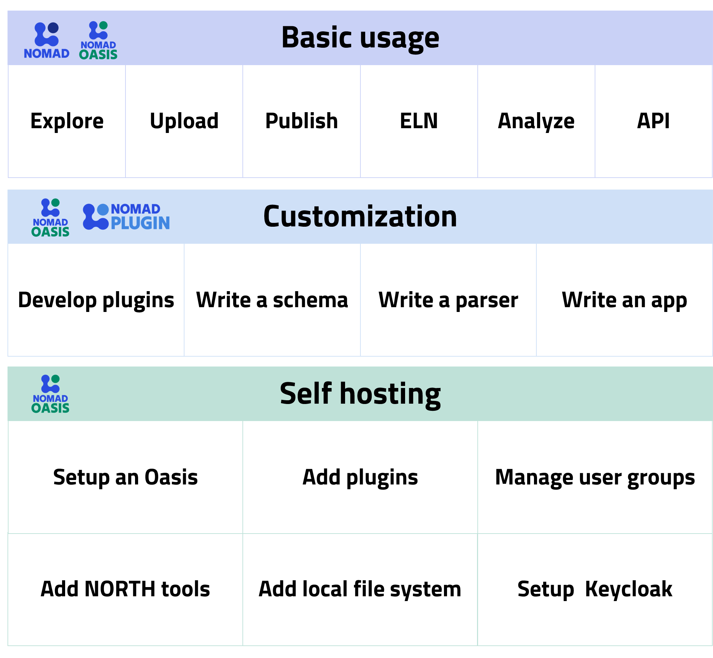
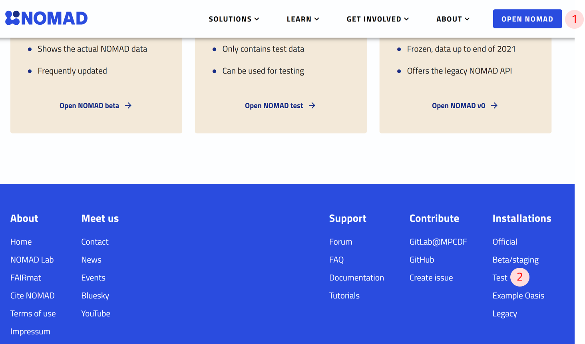
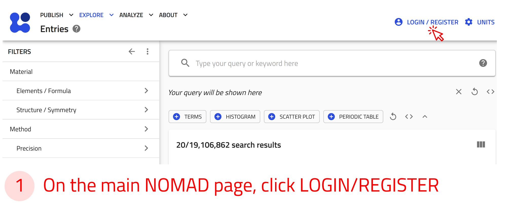
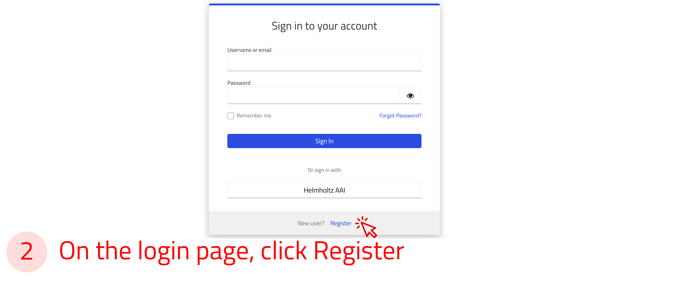
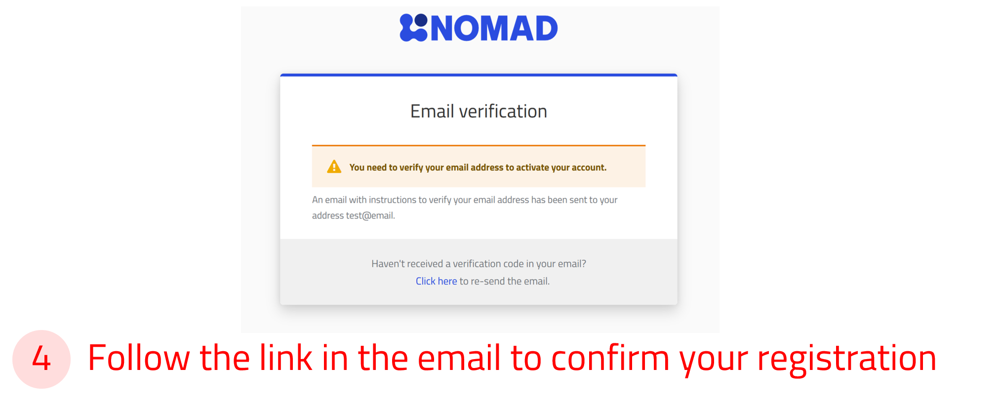
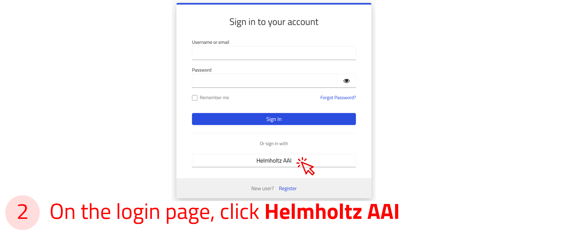
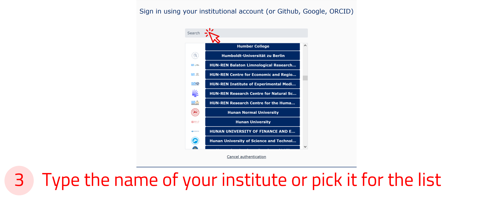

# NOMAD tutorials

This section of the documentation provides practical, hands-on instructions for working with NOMAD. These tutorials are designed to guide you through specific tasks while focusing on key learning outcomes.
They provide a structured learning experience that helps you apply concepts to real-world scenarios while reinforcing your knowledge.

As you go through the tutorial pages, you will encounter embedded boxes with different colors and icons, each providing distinct types of information or instructions. Below is a list of the various box types and guidance on how to use them:

!!! info "Offers additional information to enhance your understanding of NOMAD."

!!! task "Presents hands-on tasks or questions with instructions to complete them."

!!! example "Shares example files for you to try out, along with explanations of their contents and scientific use cases."

!!! success "Marks a checkpoint or an output to verify your result before continuing."

!!! warning "Displays important warnings to consider before proceeding further in the tutorial."

## Scope of the tutorials

NOMAD is available in two flavours to address the diverse needs of scientists: [**Central NOMAD**](https://nomad-lab.eu/nomad-lab/nomad.html){:target="_blank" rel="noopener"} and [**NOMAD Oasis**](https://nomad-lab.eu/nomad-lab/nomad-oasis.html){:target="_blank" rel="noopener"}. To learn more about these solutions, refer to our [web page](https://nomad-lab.eu/){:target="_blank" rel="noopener"}.

Our tutorial documentation covers the basics of using Central NOMAD and NOMAD Oasis. These tasks range from basic operations using the graphical user interface (GUI), to low-barrier tailoring of electronic lab notebooks, and robust customization with plugins.

### Tutorial topics

[**Exploring data**](explore.md)

- Find and access data using the search interface and the filter sidebar.
- Create custom widgets for a personalized search experience.
- Use the NOMAD domain-specific apps.

[**Uploading and publishing data**](upload_publish.md)

- Create a NOMAD upload and share it with your colleagues.
- Add research data files to the upload and create entries.
- Create datasets and publish them with a DOI.

[**Using NOMAD as an ELN**](eln/built_in_templates.md)

- [Use built-in ELN templates](eln/built_in_templates.md) to create an ELN in NOMAD and interlink substances, samples, instruments, processes, and measurements.
- [Create a custom ELN schema using YAML](eln/custom_eln_yaml.md) and extend it with subsections for your experiment structure.
- [Parse tabular measurement data](eln/tabular_parser_yaml.md) with the NOMAD's tabular parser and visualize it directly in the ELN.

[**Managing workflows and projects**](workflows_projects.md)

- Organize and manage complex research workflows using NOMAD.
- Interface with NOMAD programmatically for automation and high-throughput use.

[**Creating custom schemas**](custom.md)

- Create a custom NOMAD ELN schema using YAML files.
- Create a parser for your tabular data (.xls or .csv).

[**Developing NOMAD plugins**](develop_plugin/plugin_structure.md)

- Use the NOMAD GitHub template to create plugins.
- Install plugins to your NOMAD Oasis.

### User skill levels

An overview of the skills required to use NOMAD and NOMAD Oasis, categorized into basic use, customization, and self hosting, is presented in the figure below.

---

## Ways to access NOMAD

There are multiple access points to NOMAD. The general [*landing page*](https://nomad-lab.eu/nomad-lab/){:target="_blank" rel="noopener"} provides an overview of NOMAD’s features, along with links to documentation, tutorials, and project history.

From this page, we can navigate to NOMAD to upload, manage, and explore data.

Two public versions that are relevant to the tutorials are:

1. [**Official**](https://nomad-lab.eu/prod/v1/gui/search/entries){:target="_blank" rel="noopener"} – The latest stable version of NOMAD.

    Access it by clicking the "Open NOMAD" button at the top of the landing page.

2. [**Test**](https://nomad-lab.eu/prod/v1/test/gui/search/entries){:target="_blank" rel="noopener"} – Runs the latest released version of NOMAD but on temporary test data that is routinely wiped.

    Access it from the *Installations* menu at the bottom of the landing page by selecting "Test."

!!! info "These tutorials are based on the official version of NOMAD. All instructions are based on it unless stated otherwise."

    

---

## Create a NOMAD user account

A NOMAD user account is required if you want to upload, share, publish, or analyze your data. However, exploring data in NOMAD does not require an account. Creating a NOMAD user account is quick and free!

**Use the arrow buttons ⬅️➡️ below to slide through the steps and create a NOMAD account.**

    
←

    
    
    
    
    
→

---

## Login options via Helmholtz AAI

You can also log in to NOMAD using your university or research institute credentials, or with social accounts such as GitHub, ORCID, or Google via the [Helmholtz AAI](https://hifis.net/aai/){:target="_blank" rel="noopener"} (Authentication and Authorization Infrastructure).

To sign in, select the Helmholtz AAI option in the login form, then choose your institution or preferred social account from the list.

You will be redirected to your institution’s login page, where you can enter your credentials securely.

!!! info "Helmholtz AAI ensures secure and privacy-compliant authentication 🔒. Most major universities and research institutions in Germany and across Europe are supported."

**Use the arrow buttons ⬅️➡️ below to see how to sign in via Helmholtz AAI.**

    
←

    
    
    
    
→

---
