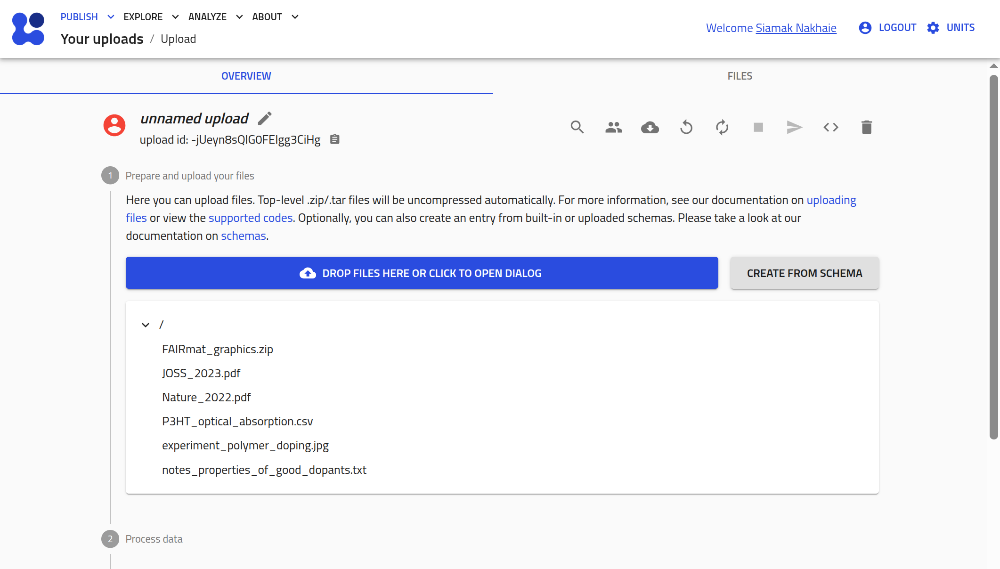
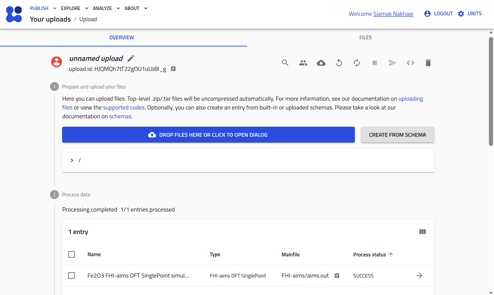
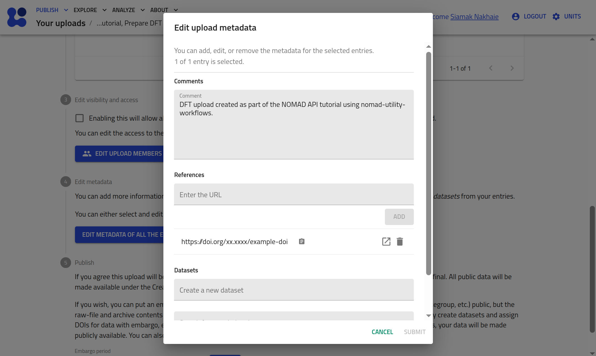
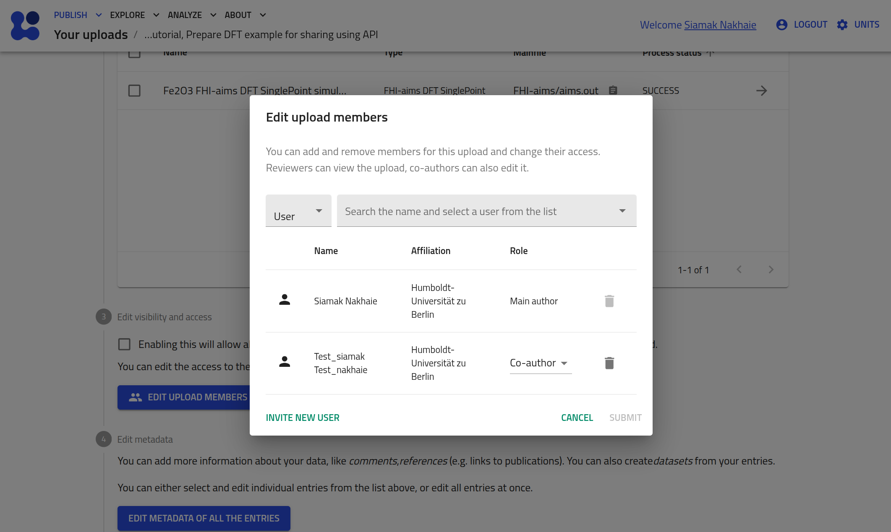

<!-- markdownlint-disable MD013 -->
<!-- Disabled MD013: long lines are needed in this tutorial -->

# Upload and publish data using the NOMAD API

In this tutorial, we interact with the NOMAD API using Python and the [`nomad-utility-workflows`](https://fairmat-nfdi.github.io/nomad-utility-workflows/){:target="_blank" rel="noopener"} package, to programmatically perform the full data upload and publishing workflow. We work with example data files to inspect generated entries, modify metadata, organize entries into datasets, and publish the results on the NOMAD test deployment. By the end of the tutorial, we will have reproduced the core upload and publishing workflows available in the NOMAD GUI.

---

## What you will learn

In this tutorial, you will learn how to:

1. Authenticate with the NOMAD API using Python
2. Upload raw research data to NOMAD and create uploads programmatically
3. Retrieve uploads and entries and inspect or edit their metadata
4. Group entries into datasets for curation and organization
5. Share uploads with collaborators and manage access permissions
6. Publish uploads on the NOMAD test deployment

---

## Before you begin

This tutorial assumes basic familiarity with Python and programmatic workflows.

Before starting, make sure you have the following:

1. **NOMAD user account**  
   In order to interact with the NOMAD API, a user account is required.
   You can create an account by following the steps described in the [overview page](overview.md#create-a-nomad-user-account).

2. **Python environment**  
   A Python 3.11 or newer environment with permission to install external packages.  
   The examples in this tutorial are designed to be run in a Jupyter notebook.

3. **Basic Python knowledge**  
   You should be comfortable running Python code, installing packages, and working with notebooks.

4. **Example files available on your local machine**  
   This tutorial uses provided example data files for:
    - [Miscellaneous files (PDF, images, tables)](https://github.com/FAIRmat-NFDI/FAIRmat-tutorial-16/raw/refs/heads/main/tutorial_16_materials/part_3_files/example_files_upload/miscellaneous_data/miscellaneous_data.zip){:target="_blank" rel="noopener"},
    - [Computational data (DFT calculations)](https://github.com/FAIRmat-NFDI/FAIRmat-tutorial-16/raw/refs/heads/main/tutorial_16_materials/part_3_files/example_files_upload/computations_data/FHI-aims.zip){:target="_blank" rel="noopener"},
    - [Experimental data (XPS measurements)](https://github.com/FAIRmat-NFDI/FAIRmat-tutorial-16/raw/refs/heads/main/tutorial_16_materials/part_3_files/example_files_upload/experiments_data/xps_nexus_data.zip){:target="_blank" rel="noopener"}.

!!! warning
    The code snippets in this tutorial are designed to be run sequentially in a Jupyter notebook.
    Running code snippets out of order may lead to errors, e.g., due to missing imports, variables, or setup steps that were introduced earlier. For a smooth experience, it's suggested to follow the steps in order.

---

## Environment setup

In this tutorial, we will use the [NOMAD test deployment](https://nomad-lab.eu/prod/v1/test/gui/search/entries){:target="_blank" rel="noopener"}. Therefore, in all code examples, we will set `url="test"` when calling the helper functions. Later, you can switch to `url="prod"` or a custom NOMAD API URL if needed.

We assume you are working in a Python 3.11+ environment, preferably in a dedicated virtual environment for this tutorial.

??? info "Need help creating a project folder, Python environment, and Jupyter kernel?"

    This optional section shows how to create a **project folder**, set up a **clean Python environment**, and ensure that Jupyter uses the correct kernel for this tutorial.

    ---
    **1. Create a project folder**

    Open a terminal (or PowerShell on Windows) and run:

    ```bash
    mkdir nomad-api-tutorial
    cd nomad-api-tutorial
    ```

    All files used in this tutorial (notebooks, ZIP files, and `env.txt`) should be placed in this folder.

    ---
    **2. Create a virtual Python environment**

    - Linux / macOS:
      ```bash
      python3 -m venv nomad-env
      ```

    - Windows (PowerShell):
      ```powershell
      python -m venv nomad-env
      ```

    ---
    **3. Activate the environment**

    - Linux / macOS:
      ```bash
      source nomad-env/bin/activate
      ```

    - Windows (PowerShell):
      ```powershell
      nomad-env\Scripts\Activate.ps1
      ```

    Once activated, your terminal prompt should show `(nomad-env)`.

    ---
    **4. Install Jupyter and required tools**

    ```bash
    pip install --upgrade pip
    pip install jupyterlab ipykernel
    ```

    ---
    **5. Register the environment as a Jupyter kernel**

    ```bash
    python -m ipykernel install --user --name nomad-env --display-name "Python (nomad-env)"
    ```

    This step ensures that Jupyter can use the Python environment created for this tutorial.

    ---
    **6. Start Jupyter**

    ```bash
    jupyter lab
    ```

    Open or create a notebook (`.ipynb`), then select the kernel:
    **Kernel → Change Kernel… → Python (nomad-env)**.

    ---
    **7. Verify the selected kernel**

    Run the following cell in your notebook:

    ```python
    import sys
    print(sys.executable)
    ```

    The printed path should point to `nomad-env`. If not, re-select the kernel.

Install the plugin and helper packages:

<!-- markdownlint-disable MD046 -->
```bash
!pip install --upgrade pip
!pip install "nomad-utility-workflows[vis]>=0.2.0"
!pip install python-dotenv
```
<!-- markdownlint-disable MD046 -->

The `nomad-utility-workflows` provides high-level helpers for interacting with the NOMAD API and `python-dotenv` is used to load credentials from a local file, e.g., `env.txt`.

Create a file named `env.txt` in your project folder with the following content and save this file next to your notebook or script and keep it private (do not commit it to version control):

```text
NOMAD_USERNAME=your_email_or_username
NOMAD_PASSWORD=your_password
```

Before calling any helper functions, load `env.txt` so that the environment variables are visible to `nomad-utility-workflows`:

<!-- markdownlint-disable MD046 -->
```python
from dotenv import load_dotenv

load_dotenv("env.txt")
```
<!-- markdownlint-disable MD046 -->

??? success "Example notebook output"

    ```
    True
    ```

This makes `NOMAD_USERNAME` and `NOMAD_PASSWORD` available to the package via environment variables.

Now you can check which user you are authenticated as, and confirm that the credentials were loaded correctly using:

<!-- markdownlint-disable MD046 -->
```python
from nomad_utility_workflows.utils.users import who_am_i

me = who_am_i(url="test")
print("Authenticated as:", me.name)
print("Username:", me.username)
print("Email:", me.email)
```
<!-- markdownlint-disable MD046 -->

??? success "Example notebook output"

    ```
    Authenticated as: Siamak Nakhaie
    Username: siamak.nakhaie@physik.hu-berlin.de
    Email: siamak.nakhaie@physik.hu-berlin.de
    ```

This call confirms which NOMAD account is being used.

---

## Create uploads

Next, you create uploads in NOMAD from the three example ZIP files.
The helper `upload_files_to_nomad` both **creates a new upload** and **attaches the given ZIP file** in a single step (in the GUI these are two actions; here they are combined into one API call).

!!! warning

    All uploads in this tutorial must be sent to the **[Test Deployment of NOMAD](https://nomad-lab.eu/prod/v1/test/gui/about/information){:target="_blank" rel="noopener"}** The data there **is not persistent** and will be deleted occasionally, which ensures that you can safely test uploading and publishing without affecting public data.
    When running code snippets, always make sure that the `url` parameter is set to `test`, i.e.,
    `url="test"`.

### Upload miscellaneous files

As a first example, upload the miscellaneous files to the 'test' NOMAD instance:

<!-- markdownlint-disable MD046 -->
```python
import os
from nomad_utility_workflows.utils.uploads import upload_files_to_nomad, get_upload_by_id

misc_zip_path = os.path.abspath("miscellaneous_data.zip")
misc_upload_id = upload_files_to_nomad(filename=misc_zip_path, url="test")
```
<!-- markdownlint-enable MD046 -->

In this code:

- `os.path.abspath("miscellaneous_data.zip")` resolves the ZIP file to an absolute path.
- `upload_files_to_nomad(...)` uploads the file to the NOMAD test deployment and returns a new `upload_id`.

Let's now inspect the Upload and compare it with what we see in the GUI:

<!-- markdownlint-disable MD046 -->
```python
misc_upload = get_upload_by_id(upload_id = misc_upload_id, url="test")

print("Upload summary:")
print("----------------")
print("Upload ID:      ", misc_upload.upload_id)
print("Entries:        ", misc_upload.entries)
print("Published:      ", misc_upload.published)
print("Embargo:        ", misc_upload.with_embargo)
print("GUI URL:        ", misc_upload.nomad_gui_url)
```
<!-- markdownlint-enable MD046 -->

??? success "Example notebook output"

    ```
    Upload summary:
    ----------------
    Upload ID:       -jUeyn8sQlG0FEIgg3CiHg
    Entries:         0
    Published:       False
    Embargo:         False
    GUI URL:         https://nomad-lab.eu/prod/v1/test/gui/user/uploads/upload/id/-jUeyn8sQlG0FEIgg3CiHg
    ```

This code does the following:

- `get_upload_by_id(...)` retrieves the upload metadata as a `NomadUpload` object.
- The final `print(...)` statements show a compact summary: `upload_id`, `entries`, `published`, `with_embargo`, and the `nomad_gui_url`.

In the NOMAD GUI, the upload you just created looks like this:

<!-- markdownlint-disable MD033 -->
<div style="text-align: center;">
    
</div>
<!-- markdownlint-enable MD033 -->

### Upload computational data

You can repeat the same pattern for the DFT example (`FHI-aims.zip`) to create a separate upload for simulated data and inspect its entries:

<!-- markdownlint-disable MD046 -->
```python
dft_zip_path = os.path.abspath("FHI-aims.zip")
dft_upload_id = upload_files_to_nomad(filename=dft_zip_path, url="test")

dft_upload = get_upload_by_id(upload_id = dft_upload_id, url="test")
print("GUI URL:", dft_upload.nomad_gui_url)
```
<!-- markdownlint-enable MD046 -->

??? success "Example notebook output"

    ```
    GUI URL: https://nomad-lab.eu/prod/v1/test/gui/user/uploads/upload/id/HJQMQh7tT22gOU1uLbBI_g
    ```
This snippet creates a new upload for the DFT ZIP file and prints a direct GUI link where you can monitor its processing status.

To check whether entries were created, retrieve them, and print their IDs and URLs, you can type the following:

<!-- markdownlint-disable MD046 -->
```python
from nomad_utility_workflows.utils.entries import get_entries_of_upload

dft_entries = get_entries_of_upload(upload_id= dft_upload_id, url="test", with_authentication=True)
for entry in dft_entries:
    print(entry.entry_id, entry.nomad_gui_url)
```
<!-- markdownlint-disable MD046 -->

This snippet retrieves all the entries (here only one entry) created from the uploaded computations data and prints each entry’s ID together with its direct GUI URL.

??? success "Example notebook output"

    ```
    cvEq4wXAf3dN4xJv1hM7Mz040C38 https://nomad-lab.eu/prod/v1/test/gui/user/uploads/upload/id/HJQMQh7tT22gOU1uLbBI_g/entry/id/cvEq4wXAf3dN4xJv1hM7Mz040C38
    ```

!!! warning
    If NOMAD is still processing the upload, the list may be empty. Wait a few seconds and retry.

You can also inspect the same upload in the NOMAD GUI using the link printed earlier. The upload page will look similar to the example shown below:

<!-- markdownlint-disable MD033 -->
<div style="text-align: center;">
    
</div>
<!-- markdownlint-enable MD033 -->

### Upload experimental data

The steps are similar to those you followed for the computations data.

??? example "Exercise: Upload XPS data and print the entry URL"

    Upload the file `xps_nexus_data.zip` to the NOMAD **test** deployment and print the GUI URL of the entry created from that upload.

??? success "Solution"

    Here is a ready-to-paste snippet for your Jupyter notebook:
    ```python
    import os
    import time
    from nomad_utility_workflows.utils.uploads import upload_files_to_nomad, get_upload_by_id
    from nomad_utility_workflows.utils.entries import get_entries_of_upload

    xps_zip_path = os.path.abspath("xps_nexus_data.zip")
    xps_upload_id = upload_files_to_nomad(filename=xps_zip_path, url="test")

    xps_upload = get_upload_by_id(xps_upload_id, url="test")
    print("Upload GUI URL:", xps_upload.nomad_gui_url)

    time.sleep(15)

    xps_entries = get_entries_of_upload(upload_id = xps_upload_id, url="test", with_authentication=True)
    for entry in xps_entries:
        print(entry.entry_id, entry.nomad_gui_url)
    ```
    **Example notebook output**

    ```
    Upload GUI URL: https://nomad-lab.eu/prod/v1/test/gui/user/uploads/upload/id/VcjEreRpRQOU5kVWwUnFRg
    iPR66Q3MGMMc1W3mMu87HdVwR9nD https://nomad-lab.eu/prod/v1/test/gui/user/uploads/upload/id/VcjEreRpRQOU5kVWwUnFRg/entry/id/iPR66Q3MGMMc1W3mMu87HdVwR9nD
    ```

### Inspect an upload

After creating an upload, e.g., the DFT upload, it is important to check whether NOMAD has finished processing it and whether any errors occurred.

<!-- markdownlint-disable MD046 -->
```python
dft_upload = get_upload_by_id(upload_id = dft_upload_id, url="test")

print("Upload status:")
print("--------------")
print("Upload ID:      ", dft_upload.upload_id)
print("Process status: ", dft_upload.process_status)
print("Errors:         ", dft_upload.errors)
print("Warnings:       ", dft_upload.warnings)
print("Entries:        ", dft_upload.entries)
print("Published:      ", dft_upload.published)
print("Open in GUI:    ", dft_upload.nomad_gui_url)
```
<!-- markdownlint-disable MD046 -->

??? success "Example notebook output"

    ```
    Upload status:
    --------------
    Upload ID:       HJQMQh7tT22gOU1uLbBI_g
    Process status:  SUCCESS
    Errors:          []
    Warnings:        []
    Entries:         1
    Published:       False
    Open in GUI:     https://nomad-lab.eu/prod/v1/test/gui/user/uploads/upload/id/HJQMQh7tT22gOU1uLbBI_g
    ```
This snippet:

- Retrieves the latest state of your DFT upload from the NOMAD API, using `dft_upload_id`
- Shows the processing status and any errors or warnings.
- Tells you how many entries were created.
- Provides a direct link to inspect the upload in the NOMAD GUI.

Once the upload has been processed successfully, you can list all entries that were created from the uploaded files.

<!-- markdownlint-disable MD046 -->
```python
from nomad_utility_workflows.utils.entries import get_entries_of_upload

dft_entries = get_entries_of_upload(
    upload_id=dft_upload_id,
    url="test",
    with_authentication=True,
)

print(f"Found {len(dft_entries)} entries in the DFT upload:\n")
for entry in dft_entries:
    print(
        f"- entry_id: {entry.entry_id}\n"
        f"  name: {entry.entry_name}\n"
        f"  parser: {entry.parser_name}\n"
        f"  published: {entry.published}\n"
        f"  GUI URL: {entry.nomad_gui_url}\n"
    )
```
<!-- markdownlint-enable MD046 -->

??? success "Example notebook output"

    ```
    Found 1 entries in the DFT upload:

    - entry_id: cvEq4wXAf3dN4xJv1hM7Mz040C38
      name: Fe2O3 FHI-aims DFT SinglePoint simulation
      parser: electronicparsers:fhiaims_parser_entry_point
      published: False
      GUI URL: https://nomad-lab.eu/prod/v1/test/gui/user/uploads/upload/id/HJQMQh7tT22gOU1uLbBI_g/entry/id/cvEq4wXAf3dN4xJv1hM7Mz040C38

    ```

This code:

- Retrieves all entries belonging to the DFT upload.
- Prints a compact summary for each entry, including ID, name, parser, and publication status.
- Provides a GUI link for each entry so you can open it directly in NOMAD.

---

## Share and publish uploads

After your upload has been created and processed, you can modify its metadata to prepare it for sharing or publication.
In the examples below, we use `dft_upload_id` to refer to the DFT upload, but the same pattern applies to any other upload.

### Edit upload's metadata

You can update the upload's **name** as well as the **entry-level metadata** (such as comment and references) for all entries contained in the upload. The function `edit_upload_metadata` applies metadata changes to **every entry in the upload**, similar to clicking the GUI button **EDIT METADATA OF ALL THE ENTRIES** in the upload page.

<!-- markdownlint-disable MD046 -->
```python
from nomad_utility_workflows.utils.uploads import edit_upload_metadata, get_upload_by_id
from nomad_utility_workflows.utils.entries import get_entries_of_upload

metadata_update = {
    "upload_name": "NOMAD Tutorial, Prepare DFT example for sharing using API",
    "comment": "DFT upload created as part of the NOMAD API tutorial using nomad-utility-workflows.",
    "references": ["https://doi.org/xx.xxxx/example-doi"],
}

# Apply the metadata update
edit_upload_metadata(
    upload_id=dft_upload_id,
    url="test",
    upload_metadata=metadata_update,
)
```
<!-- markdownlint-enable MD046 -->

??? success "Example notebook output"

    ```
    {'upload_id': 'HJQMQh7tT22gOU1uLbBI_g',
     'data': {'process_running': False,
      'current_process': '_edit_upload_metadata',
      'process_status': 'SUCCESS',
      'last_status_message': 'Process completed successfully',
      'errors': [],
      'warnings': [],
      'upload_id': 'HJQMQh7tT22gOU1uLbBI_g',
      'upload_name': 'NOMAD Tutorial, Prepare DFT example for sharing using API',
      'upload_create_time': '2025-12-08T15:38:58.775000',
      'main_author': 'ebb26223-0cec-4d81-98f5-3b25db945b54',
      'coauthors': [],
      'coauthor_groups': [],
      'reviewers': [],
      'reviewer_groups': [],
      'writers': ['ebb26223-0cec-4d81-98f5-3b25db945b54'],
      'writer_groups': [],
      'viewers': ['ebb26223-0cec-4d81-98f5-3b25db945b54'],
      'viewer_groups': [],
      'published': False,
      'published_to': [],
      'with_embargo': False,
      'embargo_length': 0,
      'license': 'CC BY 4.0',
      'entries': 1,
      'upload_files_server_path': '/nomad/test/fs/staging/H/HJQMQh7tT22gOU1uLbBI_g'}}
    ```
This code updates the upload name and applies the comment and references to all entries in the upload.

!!! warning
    Running the next snippet before NOMAD finishes processing the entries may make it *look* as if the entries metadata is not updated. Wait up to 2 minutes and retry to ensure the snippet is executed only after NOMAD processing has completed.

To inspect it programmatically try:

<!-- markdownlint-disable MD046 -->
```python
# Upload-level metadata (only the name appears here)
updated_upload = get_upload_by_id(dft_upload_id, url="test")
print("Upload name (upload-level):", updated_upload.upload_name)

# Entry-level metadata (comment and references live here)
entries = get_entries_of_upload(upload_id = dft_upload_id, url="test", with_authentication=True)
for entry in entries:
    print("\nEntry ID:", entry.entry_id)
    print("Entry comment:", entry.comment)
    print("Entry references:", entry.references)
```
<!-- markdownlint-enable MD046 -->

??? success "Example notebook output"

    ```
    Upload name (upload-level): NOMAD Tutorial, Prepare DFT example for sharing using API

    Entry ID: cvEq4wXAf3dN4xJv1hM7Mz040C38
    Entry comment: DFT upload created as part of the NOMAD API tutorial using nomad-utility-workflows.
    Entry references: ['https://doi.org/xx.xxxx/example-doi']
    ```

Retrieving the entries again confirms that the metadata was updated correctly at the entry level.

You can also confirm the changes by clicking **EDIT METADATA OF ALL THE ENTRIES** in the test deployment GUI for that upload. You will see that the metadata has been updated for all the entries of this upload.

<!-- markdownlint-disable MD033 -->
<div style="text-align: center;">
    
</div>
<!-- markdownlint-enable MD033 -->

### Assign the upload to a dataset

You can group your upload into a dataset so that related entries can later be queried or managed together.

<!-- markdownlint-disable MD046 -->
```python
from nomad_utility_workflows.utils.datasets import create_dataset

dataset_name = "Example dataset to contain DFT data"
dataset_id = create_dataset(dataset_name=dataset_name, url="test")
print(f"Created dataset: dataset_id={dataset_id}, dataset_name='{dataset_name}'")
```
<!-- markdownlint-enable MD046 -->

??? success "Example notebook output"

    ```
    Created dataset: dataset_id=431csah2RKSEV3ic38FmTA, dataset_name='Example dataset to contain DFT data'
    ```

To assign the upload, i.e., the entries of the upload, to the dataset you have created, it is enough that we update the upload's metadata to include the `dataset_id`:

<!-- markdownlint-disable MD046 -->
```python
edit_upload_metadata(
    upload_id=dft_upload_id,
    url="test",
    upload_metadata={"dataset_id": dataset_id},
)
```
<!-- markdownlint-enable MD046 -->

??? success "Example notebook output"

    ```
    {'upload_id': 'HJQMQh7tT22gOU1uLbBI_g',
     'data': {'process_running': False,
      'current_process': '_edit_upload_metadata',
      'process_status': 'SUCCESS',
      'last_status_message': 'Process completed successfully',
      'errors': [],
      'warnings': [],
      'upload_id': 'HJQMQh7tT22gOU1uLbBI_g',
      'upload_name': 'NOMAD Tutorial, Prepare DFT example for sharing using API',
      'upload_create_time': '2025-12-08T15:38:58.775000',
      'main_author': 'ebb26223-0cec-4d81-98f5-3b25db945b54',
      'coauthors': [],
      'coauthor_groups': [],
      'reviewers': [],
      'reviewer_groups': [],
      'writers': ['ebb26223-0cec-4d81-98f5-3b25db945b54'],
      'writer_groups': [],
      'viewers': ['ebb26223-0cec-4d81-98f5-3b25db945b54'],
      'viewer_groups': [],
      'published': False,
      'published_to': [],
      'with_embargo': False,
      'embargo_length': 0,
      'license': 'CC BY 4.0',
      'entries': 1,
      'upload_files_server_path': '/nomad/test/fs/staging/H/HJQMQh7tT22gOU1uLbBI_g'}}
    ```

This assigns all entries contained in the upload to the newly created dataset.
You can later verify this in the GUI under **EDIT METADATA** for any entry.

### Share the upload with selected users

If you wish, you can collaborate on this upload by sharing it with selected NOMAD users of your choice. To do this, you first need to locate their NOMAD user account (their `user_id`). Once you have their `user_id`, you can assign them as a **coauthor** (write access) or a **reviewer** (read-only access).

Let’s start by searching for the user you want to share your upload with. Replace `SearchSurname` in the snippet below with the name of that NOMAD user.

<!-- markdownlint-disable MD046 -->
``` python
from nomad_utility_workflows.utils.users import search_users_by_name

candidates = search_users_by_name("SearchSurname", url="test")

for user in candidates:
    print(f"Found the user '{user.name}' with user_id='{user.user_id}'")
```
<!-- markdownlint-enable MD046 -->

??? success "Example notebook output"

    ```
    Found the user 'Test_siamak Test_nakhaie' with user_id='f250f5ab-b05c-4bad-9939-5f4883c7a694'
    ```

Once the user appears in the output, copy their `user_id`. In the next step, paste this `user_id` into the appropriate list and comment out all lines related to the role you do not want to assign.

<!-- markdownlint-disable MD046 -->
```python
from nomad_utility_workflows.utils.uploads import edit_upload_metadata

coauthor_ids = ["paste-user-id-here"]     # write access
reviewer_ids = ["paste-user-id-here"]     # read-only access

edit_upload_metadata(
    upload_id=dft_upload_id,
    url="test",
    upload_metadata={
        "coauthors": coauthor_ids, # comment out if not needed
        "reviewers": reviewer_ids, # comment out if not needed
    },
)

print("Access updated.")
```
<!-- markdownlint-enable MD046 -->

??? success "Example notebook output"

    ```
    Access updated.
    ```
If you wish, you can verify this in the upload page by clicking **EDIT UPLOAD MEMBERS**, which will look similar to:

<!-- markdownlint-disable MD033 -->
<div style="text-align: center;">
    
</div>
<!-- markdownlint-enable MD033 -->

### Set an embargo period

If you plan to publish your upload to NOMAD but want to delay when it becomes visible to everyone, you can set an embargo period. The example below applies an embargo of one month.

<!-- markdownlint-disable MD046 -->
```python
edit_upload_metadata(
    upload_id=dft_upload_id,
    url="test",
    upload_metadata= {"embargo_length" : 1},
)

upload_with_embargo = get_upload_by_id(dft_upload_id, url="test")
print("With embargo:", upload_with_embargo.with_embargo)
print("Embargo length:", upload_with_embargo.embargo_length)
```
<!-- markdownlint-enable MD046 -->

??? success "Example notebook output"

    ```
    With embargo: True
    Embargo length: 1.0
    ```

### Publish the upload

You can now publish your upload on the NOMAD **test** deployment:

!!! warning
    Publishing data on the production server requires that you have the **rights to the data** and are **eligible to release them under the CC BY 4.0 license**, and this action is **irreversible**.
    For this tutorial, we use the test deployment. Please make sure that `url="test"` is set before triggering any publication action.

<!-- markdownlint-disable MD046 -->
```python
from nomad_utility_workflows.utils.uploads import publish_upload
from pprint import pprint

response = publish_upload(upload_id=dft_upload_id, url="test")
pprint(response)
```
<!-- markdownlint-enable MD046 -->

??? success "Example notebook output"

    ```
    {'data': {'coauthor_groups': [],
                'coauthors': ['f250f5ab-b05c-4bad-9939-5f4883c7a694'],
                'current_process': '_edit_upload_metadata',
                'embargo_length': 1,
                'entries': 1,
                'errors': [],
                'last_status_message': 'Process completed successfully',
                'license': 'CC BY 4.0',
                'main_author': 'ebb26223-0cec-4d81-98f5-3b25db945b54',
                'process_running': True,
                'process_status': 'PENDING',
                'published': False,
                'published_to': [],
                'reviewer_groups': [],
                'reviewers': [],
                'upload_create_time': '2025-12-08T15:38:58.775000',
                'upload_id': 'HJQMQh7tT22gOU1uLbBI_g',
                'upload_name': 'NOMAD Tutorial, Prepare DFT example for sharing '
                                'using API',
                'viewer_groups': [],
                'viewers': ['ebb26223-0cec-4d81-98f5-3b25db945b54',
                            'f250f5ab-b05c-4bad-9939-5f4883c7a694'],
                'warnings': [],
                'with_embargo': True,
                'writer_groups': [],
                'writers': ['ebb26223-0cec-4d81-98f5-3b25db945b54',
                            'f250f5ab-b05c-4bad-9939-5f4883c7a694']},
        'upload_id': 'HJQMQh7tT22gOU1uLbBI_g'}
    ```

This code triggers the publication action for the DFT upload and prints the server response confirming the operation.
